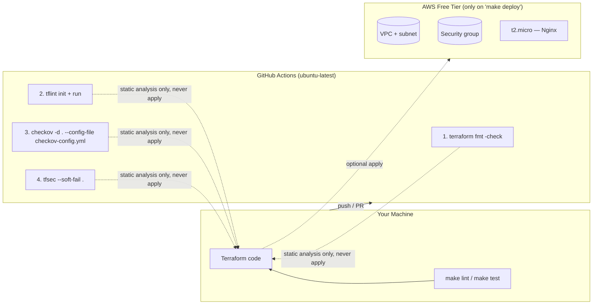

# Lab 07 — Security Scanning (checkov + tfsec + tflint)

This lab takes the small AWS stack from Lab 05 (a VPC, a subnet, a security group, and one `t2.micro` EC2 instance running Nginx) and puts it in front of three static security scanners running in GitHub Actions: **tflint** (Terraform linter), **Checkov** (policy-as-code scanner), and **tfsec** (static analysis for Terraform). The code is *intentionally* not perfect — it contains one minor, realistic misconfiguration (`monitoring = false` on the EC2 instance) and one tagging gap, so you get to see real, non-critical findings, learn to read them, and practice the three legitimate ways to suppress a false positive.

## Learning Objectives

- Explain what static security scanning of Terraform code means — and what it cannot catch (it analyzes code, never the running cloud).
- Run four CI stages in sequence: `terraform fmt -check` → `tflint` → `checkov` → `tfsec`.
- Read a scanner finding: which check ID fired, which resource triggered it, and how severe it is.
- Decide whether a finding is a true positive (fix it) or a false positive / accepted risk (suppress it properly).
- Suppress findings three ways: a `# checkov:skip=...` inline comment, a `#tfsec:ignore:...` inline comment, and the `skip-check:` list in `checkov-config.yml` — and know when each is appropriate.
- Configure Checkov with `soft-fail: true` so a scan reports problems without breaking the build.
- Run all four scanners locally with `make lint` and `make test` before pushing.

## Architecture



The CI workflow only ever **reads** the code. The AWS resources are created only if you explicitly run `make deploy` with your own credentials — the GitHub job never touches your cloud account and needs no secrets.

## Prerequisites

**Tools** (install all, or use GitHub Codespaces where they are preinstalled):

| Tool | Version tested | Install hint |
|------|----------------|--------------|
| Git | 2.40+ | — |
| Terraform | 1.5+ | `winget install Hashicorp.Terraform` / `brew install terraform` |
| tflint | 0.50+ | `winget install tflint` / `brew install tflint` |
| Checkov | 3.x | `pip install checkov` |
| tfsec | 1.28+ | `winget install tfsec` / `brew install tfsec` |
| AWS CLI | 2.x | only needed for `make deploy` |

**Accounts:**

- A free **GitHub** account (fork this repository, push your branch, watch the Actions tab).
- A free **AWS** account — only if you want to run `make deploy`. The security-scanning part of this lab (the main content) works with **no AWS account at all**.

**Environment variables for `make deploy`** (never needed for the CI scans):

- `AWS_ACCESS_KEY_ID` and `AWS_SECRET_ACCESS_KEY` — an IAM user's programmatic credentials with limited permissions, OR
- `AWS_PROFILE` pointing at an AWS CLI profile configured via `aws configure`.
- `AWS_DEFAULT_REGION` (optional; the code defaults to `us-east-1` via `variables.tf`).

> This lab deliberately does NOT use long-lived keys in GitHub. Later labs (Lab 08) introduce GitHub OIDC to AWS. The scanner workflow in this lab needs no AWS access of any kind.

## Step-by-Step Instructions

1. **Fork and clone the repository, then switch to this lab's branch:**
   ```bash
   git clone https://github.com/<your-user>/devops-labs-terraform-ansible.git
   cd devops-labs-terraform-ansible
   git checkout lab-07-security-scanning
   ```

2. **Verify your tools:**
   ```bash
   make setup
   ```
   Expected output:
   ```
   Checking required tools for Lab 07...
   Terraform v1.9.x
   tflint version 0.53.x
   3.x.y  (checkov)
   v1.28.x (tfsec)
   Setup check complete.
   ```

3. **Look at the intentionally imperfect code.** Open `main.tf` and find the two planted findings:
   - `monitoring = false` on `aws_instance.web` (search for `INTENTIONAL FINDING #1`).
   - An incomplete `tags` block on the same resource — `Environment` is missing (`INTENTIONAL FINDING #2`).
   - Also note the security group allows port 80 from `0.0.0.0/0` — correct for a public web server, but scanners still flag it.

4. **Run the linters locally (mirrors CI steps 1–2):**
   ```bash
   make lint
   ```
   Expected output ends with:
   ```
   Lint passed.
   ```
   If `terraform fmt -check` complains, run `terraform fmt -recursive` and retry.

5. **Run the security scanners locally (mirrors CI steps 3–4):**
   ```bash
   make test
   ```
   You will see Checkov and tfsec print findings for the EC2 instance. The commands exit `0` because Checkov's `soft-fail: true` (in `checkov-config.yml`) and tfsec's `--soft-fail` flag turn findings into warnings.

6. **Read a Checkov finding.** In the output, look for a block like:
   ```
   Check: CKV_AWS_126: "Ensure that detailed monitoring is enabled for EC2 instances"
   	FAILED for resource: aws_instance.web
   ```
   Anatomy: `CKV_AWS_126` is the check ID, the quoted text is the rule, `aws_instance.web` is the resource. Every Checkov ID starts with `CKV_` + provider + number.

7. **Read the matching tfsec finding.** Look for:
   ```
   Problem: Instance does not have detailed monitoring enabled.
   Resolution: Enable detailed monitoring
   Check: aws-ec2-enable-detailed-monitoring
   ```
   tfsec uses dotted lowercase check names (`aws-ec2-enable-detailed-monitoring`) instead of `CKV_` IDs.

8. **Judge the finding — fix or suppress?** Detailed monitoring on a `t2.micro` costs money (only 1 minute/day is free), and this is a throwaway lab instance. That is an *accepted risk* — a good candidate for a documented suppression, not a fix. (In production on a real workload you would probably fix it.)

9. **Suppress it the Checkov way** — edit `main.tf` and add an inline comment directly above the flagged line:
   ```hcl
   # checkov:skip=CKV_AWS_126: Detailed monitoring costs money on t2.micro; accepted risk for a lab instance
   monitoring = false
   ```
   Rerun `make test` — the Checkov finding disappears. The comment keeps the reason **next to the code**, which is exactly where a future reviewer will look.

10. **Suppress it the tfsec way** — same idea, tfsec's comment syntax:
    ```hcl
    #tfsec:ignore:aws-ec2-enable-detailed-monitoring:exp:2025-12-31: Detailed monitoring costs money on t2.micro; accepted risk for a lab instance
    monitoring = false
    ```
    Note there is **no space** after `#` for tfsec comments. The optional `:exp:YYYY-MM-DD` makes the suppression *expire*, so it gets re-reviewed — a great habit. Rerun `make test` and the tfsec finding is gone too.

11. **(Optional) Try the third suppression mechanism — the Checkov config skip list.** Edit `checkov-config.yml` and uncomment the example under `skip-check:`:
    ```yaml
    skip-check:
      - CKV_AWS_126  # EC2 detailed monitoring — costs money on free tier
    ```
    This suppresses the check **repo-wide**. Use it only for rules your team has consciously decided to disable everywhere; one-off exceptions belong in inline comments. Prefer the inline style from step 9. When done experimenting, revert this change.

    > **Warning — prefer fixing over suppressing.** A suppression is a permanent record that you looked at a finding and chose to live with it. Every skip you add trains reviewers to ignore that check, and scanners you silence stop protecting you. Default to fixing; suppress only when you can write down a concrete reason, and always include that reason in the comment or config entry.

12. **Push and watch the real CI pipeline:**
    ```bash
    git add -A
    git commit -m "lab-07: practice security scanning suppressions"
    git push origin lab-07-security-scanning
    ```
    Open `https://github.com/<your-user>/devops-labs-terraform-ansible/actions` and click the **security-scanning** run. Expand the job and confirm you can see all four scan steps in order: `1 - terraform fmt`, `2a/2b - tflint`, `3 - checkov`, `4a/4b - tfsec`. The run should be **green** even though Checkov/tfsec list findings — that is `soft-fail` doing its job.

13. **(Optional) Deploy the stack for real.** Only if you want to see the infrastructure itself:
    ```bash
    cp terraform.tfvars.example terraform.tfvars   # edit ssh_cidr to your IP if desired
    export AWS_ACCESS_KEY_ID=... AWS_SECRET_ACCESS_KEY=...
    make deploy
    ```

## How Do I Know This Worked?

- **Local:** `make lint` prints `Lint passed.` and `make test` prints `Security scans complete` — both exit `0`.
- **Checkov finding visible:** `make test` output contains `CKV_AWS_126` and `aws_instance.web` (unless you suppressed it in step 9 — then confirm it is gone).
- **tfsec finding visible:** output contains `aws-ec2-enable-detailed-monitoring`.
- **CI green with findings:** the GitHub Actions run finishes with a green checkmark while the Checkov and tfsec step logs still contain findings. Open a step's log and confirm.
- **Suppression works:** after step 9, `make test | grep CKV_AWS_126` returns nothing, and the CI run for that commit no longer shows the finding.
- **(If deployed):** `terraform output instance_public_ip` returns an IP, and `curl http://$(terraform output -raw instance_public_ip)` returns the "Hello from Lab 07" page.

## Cleanup

- **Cloud resources (if you ran `make deploy`):**
  ```bash
  make destroy
  ```
  Type `yes` when prompted. Verify in the AWS Console → EC2 → Instances that no `lab-07-web` instance remains, and check VPC Dashboard → Your VPCs for leftover `lab-07-vpc`.
- **Local artifacts:**
  ```bash
  make clean        # removes .terraform/, tfplan, lock file
  rm -f terraform.tfvars
  ```
- **Repository:** nothing to clean — the workflow created no commits or artifacts in your repo.

## Troubleshooting

1. **`terraform fmt -check -recursive` fails in CI with a list of files.**
   - **Symptom:** CI step `1 - terraform fmt` exits non-zero naming `main.tf`.
   - **Cause:** Files are not formatted with 2-space indent / aligned `=` the way `terraform fmt` produces.
   - **Fix:** Run `terraform fmt -recursive` locally, commit the result, push again. (On Windows, do not let your editor convert indentation to tabs.)

2. **Checkov exits non-zero locally even though the CI run is green.**
   - **Symptom:** `checkov -d .` fails the build with findings; the GitHub job passes.
   - **Cause:** You ran plain `checkov -d .` without the config file — `soft-fail: true` lives in `checkov-config.yml`.
   - **Fix:** Always use `make test`, or run `checkov -d . --config-file checkov-config.yml`. (The CI passes `config_file` and an explicit `soft_fail: true` input.)

3. **`tflint: command not found` / `Failed to install tflint` in CI.**
   - **Symptom:** Step `2a - tflint init` fails with "command not found", or the setup action errors.
   - **Cause:** A pinned version in `terraform-linters/setup-tflint@v4` no longer exists upstream, or a self-hosted runner lacks network access to GitHub releases.
   - **Fix:** On github-hosted `ubuntu-latest` this should not happen; update the `tflint_version` in `.github/workflows/security.yml` to the latest release listed at `https://github.com/terraform-linters/tflint/releases`, and confirm the workflow's `runs-on: ubuntu-latest`.

## Free Tier Notes

- This lab's **core content (static scanning) is free** — it consumes only GitHub Actions minutes for public repositories (free) and no AWS resources at all unless you run `make deploy`.
- If you deploy: the stack uses a **single `t2.micro`** (750 hours/month free for the first 12 months of a new AWS account), a default VPC-style network (no cost), and one Elastic IP is **not** allocated, so there is no EIP charge. Data transfer under 1 GB/month to the internet is free.
- **Detailed monitoring is intentionally OFF** (`monitoring = false`) because it is billed beyond the first minute each day — enabling it would defeat the free-tier goal.
- Free tiers change over time. After this lab: run `make destroy`, then check the **AWS Billing console → Bills** to confirm no charges accrued.
