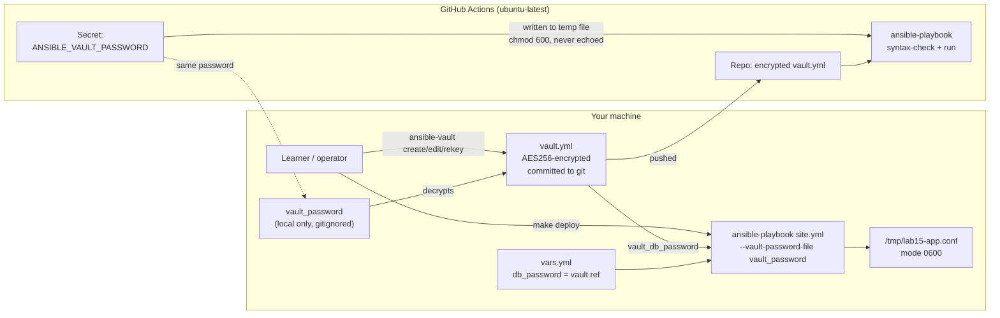

# Lab 15: Ansible Vault — Encrypting Secrets in Your Repo

Ansible Vault encrypts YAML files containing secrets (passwords, API keys) with AES256, so they can live safely in Git while CI and runs decrypt them on the fly. This lab creates a vault-encrypted `group_vars` file, references its secrets indirectly from a cleartext vars file, runs a playbook that uses a vaulted password, and wires everything up so GitHub Actions can decrypt in CI using a GitHub Secret — all on `localhost`, entirely free.

## Learning Objectives

- Create and edit vault-encrypted files with `ansible-vault create`, `edit`, `view`, `encrypt`, and `decrypt`.
- Reference vault variables indirectly (`db_password: "{{ vault_db_password }}"`) so cleartext files never hold secrets.
- Run playbooks with `--ask-vault-pass` (interactive) vs `--vault-password-file` (scripts, Make, CI).
- Rotate a vault password with `ansible-vault rekey`.
- Pass the vault password to GitHub Actions via the `ANSIBLE_VAULT_PASSWORD` secret without ever echoing it.
- Apply secret hygiene: `no_log: true` on any task that touches a secret, and `mode: 0600` on files that contain one.

## Architecture



## Prerequisites

- **Git Bash** (Windows) or any POSIX shell — all commands below are copy-paste ready.
- **Ansible >= 2.14** (`ansible --version`). Install with `pip install ansible` or your OS package manager.
- **GNU Make** (optional but recommended — it drives the whole lab).
- **A free GitHub account** with a repo where you can push this lab and configure Actions.
- Required local file: `vault_password` containing your vault password (created by `make setup`).

> The example vault password used throughout is `devops-labs`. Use it locally for convenience, but treat any real password as sensitive and **never commit it**.

## Step-by-Step Instructions

### 1. Set up the local vault password file

```bash
make setup
```

Expected output:

```
Creating local vault_password from vault_password.example ...
Done. Password file: vault_password
```

This copies `vault_password.example` (containing `devops-labs`) to `vault_password` and locks it to `chmod 600`. The real `vault_password` is gitignored.

### 2. Create the real encrypted vault file

The placeholder `ansible/group_vars/all/vault.yml` in this lab only documents the format. Replace it with a genuinely encrypted file:

```bash
ansible-vault create ansible/group_vars/all/vault.yml
```

Enter the password `devops-labs` (must match `vault_password`), then type the YAML content:

```yaml
vault_db_password: "s3cure-lab-password-123"
```

Save and exit. Verify the file now starts with the vault header:

```bash
head -1 ansible/group_vars/all/vault.yml
# $ANSIBLE_VAULT;1.1;AES256
```

### 3. Inspect and edit secrets

```bash
# View decrypted content (stdout only, file stays encrypted)
ansible-vault view ansible/group_vars/all/vault.yml --vault-password-file vault_password

# Edit in your $EDITOR — re-encrypts on save
ansible-vault edit ansible/group_vars/all/vault.yml --vault-password-file vault_password
```

### 4. Run the playbook (two ways)

Interactive password prompt:

```bash
ansible-playbook ansible/site.yml --ask-vault-pass
```

Password file (the Make/CI-friendly way):

```bash
ansible-playbook ansible/site.yml --vault-password-file vault_password
# or simply:
make deploy
```

Expected output (note the `no_log` suppression of the secret-bearing tasks):

```
TASK [Demonstrate Ansible Vault secret handling on localhost] ***
TASK [Show the decrypted database password (hidden via no_log)] ***
ok: [localhost] => {"censored": "the output has been hidden due to no_log", "changed": false}
TASK [Write fake app config containing the secret (mode 0600)] ***
changed: [localhost] => {"censored": "the output has been hidden due to no_log", "changed": true}
TASK [Report config file metadata (no secret content)] ***
ok: [localhost] => {
    "msg": "Config at /tmp/lab15-app.conf exists=True, mode=600"
}
```

### 5. Encrypt/decrypt existing files (the general workflow)

```bash
# Encrypt a cleartext file in place
ansible-vault encrypt some-secrets.yml --vault-password-file vault_password

# Decrypt back to cleartext (rarely needed — prefer `view`)
ansible-vault decrypt some-secrets.yml --vault-password-file vault_password
```

### 6. Rotate the vault password (`rekey`)

```bash
ansible-vault rekey ansible/group_vars/all/vault.yml
# New vault password: <type old password, then the new one>
```

Then update `vault_password` locally **and** the `ANSIBLE_VAULT_PASSWORD` GitHub Secret (Repo → Settings → Secrets and variables → Actions) so CI keeps working.

### 7. Configure CI

In your GitHub repo, add the secret: **Settings → Secrets and variables → Actions → New repository secret**, name `ANSIBLE_VAULT_PASSWORD`, value `devops-labs` (the password you used in step 2). The workflow `.github/workflows/ansible-vault.yml` writes it to a temp file with `chmod 600`, passes it via `--vault-password-file`, and never echoes it — then runs `--syntax-check` followed by a real run.

## How Do I Know This Worked?

```bash
# 1. The vault file is really encrypted (not the placeholder)
head -1 ansible/group_vars/all/vault.yml
# -> $ANSIBLE_VAULT;1.1;AES256

# 2. Running without a vault password FAILS loudly (proves the secret is protected)
ansible-playbook ansible/site.yml
# -> ERROR! Attempting to decrypt but no vault secrets found

# 3. The config file exists with owner-only permissions and contains the secret
ls -l /tmp/lab15-app.conf
# -> -rw------- ... /tmp/lab15-app.conf
cat /tmp/lab15-app.conf
# -> db_password=s3cure-lab-password-123

# 4. The playbook output contains the string "hidden due to no_log" and
#    NEVER the password string in any task output.
```

In GitHub: push, open the Actions tab, and confirm the `ansible-vault` workflow run is green — with no secret visible in any step log.

## Cleanup

```bash
make clean        # removes /tmp/lab15-app.conf and the local vault_password
```

Nothing cloud-side is created, so there are no cloud resources to tear down. Optionally also delete the `ANSIBLE_VAULT_PASSWORD` GitHub Secret when you're done (Settings → Secrets and variables → Actions → ANSIBLE_VAULT_PASSWORD → Remove).

## Troubleshooting

1. **Symptom:** `ERROR! Attempting to decrypt but no vault secrets found` (or `Vault format unrecognised`).
   **Cause:** You're running the playbook without providing a vault password, or `vault.yml` is still the placeholder (not a real `ansible-vault create` output).
   **Fix:** Run `ansible-vault create ansible/group_vars/all/vault.yml` as in Step 2, then run the playbook with `--vault-password-file vault_password` or `--ask-vault-pass`.

2. **Symptom:** CI fails at the syntax-check or run step with a decryption error.
   **Cause:** The GitHub Secret `ANSIBLE_VAULT_PASSWORD` doesn't match the password used to encrypt the committed `vault.yml` (forgot to update it after `ansible-vault rekey`, or a stray newline in the secret).
   **Fix:** Confirm the password locally with `ansible-vault view ansible/group_vars/all/vault.yml --vault-password-file vault_password`, then re-set the secret to exactly that value (no trailing newline) and re-run the workflow.

3. **Symptom:** The playbook runs but the password appears in CI logs / terminal output.
   **Cause:** A task that touches a secret is missing `no_log: true` (or uses `debug` on the raw vault variable without it).
   **Fix:** Add `no_log: true` to every task that prints, diffs, or renders the secret, exactly as in `ansible/site.yml`; rotate the password with `ansible-vault rekey` since it was exposed.

## Free Tier Notes

This lab creates **no cloud resources** — everything runs on `localhost` and GitHub's free `ubuntu-latest` runners, so there is nothing to bill. GitHub Secrets and Actions minutes are free for public repositories. Free tiers change over time: always run `make clean`, review your repo's Actions settings, and check the GitHub billing page after finishing.
