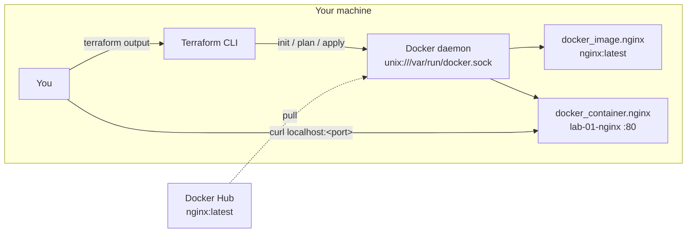

# Lab 01 — Deploy an Nginx Container with the Terraform Docker Provider

This lab is your gentle introduction to Terraform: you will use the `kreuzwerker/docker` provider to pull the official `nginx:latest` image and run a container on your **local Docker daemon**, publishing a host port that maps to the container's port 80. Everything runs on your machine (or in a GitHub Codespace) — no cloud account, no costs, no credentials.

## Learning Objectives

- Explain what a Terraform **provider** is and how `required_providers` pins one.
- Write `resource` blocks that create real infrastructure (a Docker image and container).
- Use **input variables** to make a configuration reusable without hardcoding values.
- Read **outputs** after `terraform apply` and use them to verify the deployment.
- Run the standard Terraform workflow: `init` → `plan` → `apply` → `destroy`.
- Read a CI workflow that runs `fmt`/`validate`/`plan` only, and explain why CI does not `apply` here.

## Architecture

Everything lives on your local machine — Terraform talks to the Docker daemon over its socket and creates one container:



## Prerequisites

| Tool | Version | Notes |
|---|---|---|
| Terraform | >= 1.5 | `terraform version` to check; install from https://developer.hashicorp.com/terraform/install |
| Docker Engine | any recent | Docker Desktop (Windows/Mac) or Docker Engine (Linux) |

**Accounts:** none. Docker Hub anonymous pulls work fine for `nginx`.

**Environment variables:** none required — the Docker provider talks to the local socket. Optionally, if your Docker daemon listens elsewhere (rootless Docker, remote host):

- `TF_VAR_docker_host` — e.g. `unix:///run/user/1000/docker.sock` for rootless Docker on Linux.

Verify Docker is running before you start:

```bash
docker version
```

You should see both a `Client` and `Server` section. If the `Server` section errors, start Docker Desktop (or `sudo systemctl start docker` on Linux).

## Step-by-Step Instructions

### 1. Get Docker running

- **Windows / macOS:** install [Docker Desktop](https://www.docker.com/products/docker-desktop/) and start it; wait until `docker version` shows the server.
- **Linux:** `sudo apt-get install docker.io` (Debian/Ubuntu) then `sudo usermod -aG docker $USER` and log out/in, or prefix commands with `sudo`. Verify with `docker run hello-world`.
- **GitHub Codespaces:** open this repo in a Codespace, press `Ctrl+Shift+P` → "Add Dev Container Configuration Files" → select the **Docker-in-Docker** feature, then rebuild the container. (Alternative: the default Codespaces image already includes Docker — if `docker version` works, you are done. Some images require the `sudo` setup from the Linux note above.)

### 2. Verify Terraform

```bash
terraform version
# Expected: Terraform v1.5.x (or newer)
```

### 3. Initialize the working directory

```bash
cd staging/lab-01-docker-provider
terraform init
```

Expected output (abridged):

```
Initializing the backend...
Initializing provider plugins...
- Finding kreuzwerker/docker versions matching "~> 3.0"...
- Installing kreuzwerker/docker v3.x.x...
Terraform has been successfully initialized!
```

### 4. Preview the changes

```bash
terraform plan
```

Expected: a plan showing **2 to add** (`docker_image.nginx`, `docker_container.nginx`) and `Plan: 2 to add, 0 to change, 0 to destroy.`

### 5. Apply

```bash
terraform apply
```

Type `yes` when prompted. Expected tail of output:

```
docker_image.nginx: Creation complete after 3s [id=sha256:...]
docker_container.nginx: Creation complete after 1s [id=...]

Apply complete! Resources: 2 added, 0 changed, 0 destroyed.

Outputs:
container_name = "lab-01-nginx"
mapped_port = 49153      <-- Docker picked a free port since host_port defaults to 0
url = "http://localhost:49153"
```

### 6. Verify the running container

```bash
docker ps --filter name=lab-01-nginx
# CONTAINER ID   IMAGE          COMMAND                  PORTS                                     NAMES
# a1b2c3d4e5f6   nginx:latest   "/docker-entrypoint.…"   127.0.0.1:49153->80/tcp   lab-01-nginx

curl localhost:49153
# Expected: the HTML of the "Welcome to nginx!" page (a <!DOCTYPE html> ... block)
```

(Use the port from `terraform output mapped_port`.)

### 7. (Optional) Pin a fixed port

```bash
printf 'host_port = 8080\n' > terraform.tfvars
terraform apply
curl localhost:8080
```

`terraform.tfvars` is gitignored, so your local override never gets committed.

## How Do I Know This Worked?

1. `terraform output url` prints `http://localhost:<port>` and `curl "$(terraform output -raw url)"` returns the nginx welcome page HTML (look for `Welcome to nginx!`).
2. `docker ps` shows `lab-01-nginx` with a `127.0.0.1:<port>->80/tcp` mapping.
3. `curl -I localhost:<port>` returns `HTTP/1.1 200 OK`.
4. `terraform state list` shows `docker_image.nginx` and `docker_container.nginx`.

## Cleanup

```bash
terraform destroy
# type yes

docker ps -a --filter name=lab-01-nginx   # should print only the table header (container gone)
```

Optionally remove working files entirely: `make clean`.

## Troubleshooting

**1. `Error: Error pinging Docker server: Cannot connect to the Docker daemon`**

- Symptom: `terraform plan`/`apply` fails immediately with a connection error mentioning `/var/run/docker.sock`.
- Cause: the Docker daemon is not running, or Terraform cannot reach the socket (rootless Docker uses a different path).
- Fix: start Docker Desktop / `sudo systemctl start docker`. For rootless Docker, run `export TF_VAR_docker_host=unix://$(docker context inspect --format '{{.Endpoints.docker.Host}}')` or set the exact socket path, then re-run.

**2. `Error: Unable to read Docker image into resource: unable to pull image nginx:latest`**

- Symptom: the image pull fails or times out (common behind corporate proxies or on fresh machines).
- Cause: no network access to Docker Hub, or registry authentication required.
- Fix: check `docker pull nginx:latest` manually. If it fails, fix networking/proxy settings in Docker Desktop, or sign in with `docker login` if your network requires authenticated pulls.

**3. `Error: container lab-01-nginx is already in use` / name conflict on apply**

- Symptom: `terraform apply` fails creating the container because a container named `lab-01-nginx` already exists (e.g. from a previous manual `docker run` or an orphaned apply).
- Cause: the Docker container name must be unique, and the existing one is not tracked in your Terraform state.
- Fix: remove the foreign container with `docker rm -f lab-01-nginx` and re-run `terraform apply`. To avoid the clash permanently, set a different name: `printf 'container_name = "my-nginx"\n' >> terraform.tfvars`.

## Free Tier Notes

This lab uses **only your local Docker daemon** — no cloud resources are created, so there is nothing to bill and nothing to leak. Docker Hub anonymous image pulls are free (with generous rate limits; `docker login` raises them). The GitHub Actions workflow runs on free `ubuntu-latest` runners and performs `fmt`/`init`/`validate`/`plan` only — it never applies anything. If you extend this lab to real cloud providers later, remember that free tiers change over time: always run `terraform destroy`, verify resources are gone in the provider console, and check the billing dashboard after every session.
