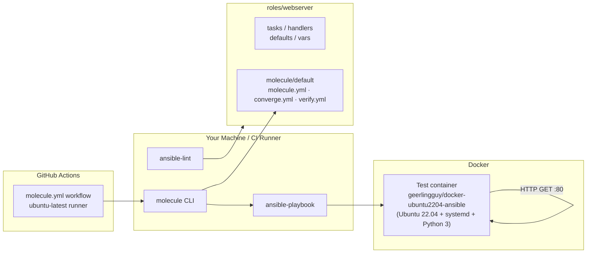

# Lab 12 — Molecule Testing (Test an Ansible Role in Docker)

In Lab 11 you refactored your Nginx playbook into a reusable `webserver` **role**. But how do you *prove* the role works — and keeps working after every change? In this lab you test the role with **Molecule**, the standard test framework for Ansible roles. Molecule spins up a throwaway Docker container, applies your role to it (**converge**), checks that a second run changes nothing (**idempotence**), runs your verification playbook (**verify**), and then destroys the container. The same test runs in **GitHub Actions** on every push, so broken roles never reach `main`.

## Learning Objectives

- Explain the Molecule test lifecycle: `dependency → create → prepare → converge → idempotence → verify → destroy`
- Configure the Molecule **Docker driver** with a systemd-capable Ubuntu 22.04 image
- Write a `converge.yml` playbook that applies a role to the test instance
- Write a `verify.yml` playbook that uses `ansible.builtin.uri` and `ansible.builtin.assert` to test real HTTP behavior
- Run individual Molecule subcommands (`converge`, `verify`, `test`) and interpret their output
- Run the full Molecule test in **GitHub Actions CI** for free

## Architecture



The role code from Lab 11 is unchanged — everything Molecule-specific lives in `roles/webserver/molecule/default/`.

## Prerequisites

| Tool | Version | Notes |
|------|---------|-------|
| Docker Desktop (or Docker Engine) | 20.10+ | Daemon **must be running**; Molecule talks to it via the `docker` Python package |
| Python | 3.10+ | `python3 --version` |
| pip | latest | Used to install the Python tooling |
| Git | any | To clone the repo |

Free accounts needed: **none** — everything runs locally in Docker or in the free GitHub Actions runner. No AWS, no Terraform Cloud, no secrets.

Environment variables: **none required**. (If your Docker daemon is remote, set `DOCKER_HOST` as usual — not needed for local Docker Desktop.)

> On Windows: run everything from **Git Bash** or WSL2, not plain `cmd`. Docker Desktop must be in Linux-container mode.

## Step-by-Step Instructions

**1. Install the tooling** (Ansible, Molecule, and the Docker driver):

```bash
make setup
```

Or manually:

```bash
python3 -m pip install --upgrade pip
python3 -m pip install ansible ansible-lint yamllint molecule "molecule-plugins[docker]" docker
```

Expected output (versions vary):

```
ansible [core 2.16.x]
molecule 6.x.x using python 3.x
```

**2. Make sure Docker is running:**

```bash
docker info >/dev/null && echo "Docker is up"
# Docker is up
```

**3. Explore the scenario.** Look at `roles/webserver/molecule/default/molecule.yml` — it defines one platform (`ubuntu2204`) based on `geerlingguy/docker-ubuntu2204-ansible`, a ready-made Ubuntu 22.04 image with Python 3 and systemd preconfigured, running in `privileged` mode with a `/sys/fs/cgroup` volume so systemd works inside the container.

> **Alternative image:** you can use a plain `ubuntu:22.04` image instead, but you must add `privileged: true`, `cgroupns_mode: host`, mount `/sys/fs/cgroup:/sys/fs/cgroup:rw`, add a `prepare.yml` playbook that installs `python3`, and make sure systemd actually starts. The geerlingguy image exists precisely to skip all that — stick with it unless you want the extra challenge.

**4. Create the test container and apply the role (converge):**

```bash
cd roles/webserver
molecule create     # starts the container
molecule converge   # runs converge.yml -> applies the webserver role
```

Expected output ends with something like:

```
PLAY RECAP *********************************************************************
ubuntu2204                 : ok=9    changed=7    unreachable=0    failed=0    skipped=0
```

**5. Verify the role actually works** — this runs `verify.yml`, which HTTP-requests Nginx and asserts HTTP 200:

```bash
molecule verify
```

Expected output:

```
TASK [Assert the index page returns HTTP 200] **********************************
ok: [ubuntu2204] => {
    "msg": "Nginx returned HTTP 200 on port 80"
}
...
PLAY RECAP *********************************************************************
ubuntu2204                 : ok=6    changed=0    failed=0
```

**6. Look inside (optional debugging):**

```bash
molecule login        # shell inside the container
curl -s localhost:80  # should print the welcome page
exit
```

**7. Run the full test sequence** — this is what CI runs:

```bash
molecule test
```

`molecule test` runs the whole lifecycle and always destroys the container at the end (even on failure). Look for the **idempotence** step: Molecule runs `converge` a second time and requires **zero** `changed` tasks. Expected tail of output:

```
PLAY RECAP *********************************************************************
ubuntu2204                 : ok=9    changed=0    unreachable=0    failed=0
...
Verifier completed successfully.
```

**8. Run it in CI.** Push the branch and open a PR — the `.github/workflows/molecule.yml` workflow installs Ansible + Molecule + the Docker driver on an `ubuntu-latest` runner and runs `molecule test` inside `roles/webserver`. No secrets needed.

## How Do I Know This Worked?

- `molecule verify` prints `Verifier completed successfully` and all three asserts show `ok`.
- The idempotence step in `molecule test` reports `changed=0` on the second converge — your role is safe to re-run.
- In GitHub: the **Molecule** workflow shows a green checkmark on your commit/PR.
- Quick manual check while the container exists (`molecule create && molecule converge`):

```bash
molecule login -- /bin/sh -c "curl -s -o /dev/null -w '%{http_code}' localhost:80"
# 200
```

## Cleanup

Molecule containers are throwaway; nothing touches the cloud.

```bash
molecule destroy          # from roles/webserver/ — removes the test container
docker ps -a | grep ubuntu2204   # confirm it is gone (should print nothing)
```

`make destroy` and `make clean` (from the lab root) wrap the same steps and also delete local caches. `molecule test` destroys the container automatically, so CI leaves nothing behind.

## Troubleshooting

**1. `Error response from daemon: ...` / "Cannot connect to the Docker daemon" when running `molecule create`**
- *Symptom:* Molecule fails immediately with a Docker connection error.
- *Cause:* The Docker daemon is not running (Docker Desktop closed, or the service is stopped).
- *Fix:* Start Docker Desktop (or `sudo systemctl start docker` on Linux) and re-run `docker info` to confirm it responds.

**2. Idempotence test fails with a non-zero `changed` count**
- *Symptom:* `molecule test` fails at the idempotence step; the second converge shows tasks in `changed`.
- *Cause:* A task is not idempotent — commonly a `command`/`shell` task that always runs, or a template that embeds a value that changes every run (like a timestamp — this is why our `index.html.j2` uses only static facts like `ansible_hostname`).
- *Fix:* Make the task state-driven: use `creates:`/`removes:` on command tasks, or replace shell one-liners with proper modules (`ansible.builtin.file`, `ansible.builtin.template`, `ansible.builtin.lineinfile`). Re-run `molecule converge` twice locally until the second run shows `changed=0`.

**3. `AttributeError: module 'docker' has no attribute ...` or "Failed to import the required Python library (Docker SDK for Python)"**
- *Symptom:* Molecule can't create the container and mentions the Docker SDK.
- *Cause:* The `docker` Python package is missing or outdated, or you installed `molecule` without the Docker driver plugin.
- *Fix:* `python3 -m pip install --upgrade "molecule-plugins[docker]" docker`. Prefer **pip** for Molecule itself (distro `apt` packages ship older, incompatible Molecule/Ansible combinations); if you already installed via apt, `python3 -m pip uninstall molecule` first, then reinstall with pip. Use a virtualenv (`python3 -m venv .venv && source .venv/bin/activate`) if your system pip is externally managed.

## Free Tier Notes

This lab creates **no cloud resources** — everything runs in a local Docker container, and CI runs on the free `ubuntu-latest` GitHub-hosted runner. Costs to worry about: none. Even so, good habits apply everywhere:

- Free tiers and quotas **change over time** — always run the Cleanup steps and check billing dashboards after labs that do touch the cloud.
- The `geerlingguy/docker-ubuntu2204-ansible` image is pulled from Docker Hub; anonymous pulls are rate-limited (currently 100/6h per IP), far more than this lab needs.
- The GitHub Actions runner is free for public repos and includes a monthly allowance for private repos — this workflow uses a few minutes per run.
