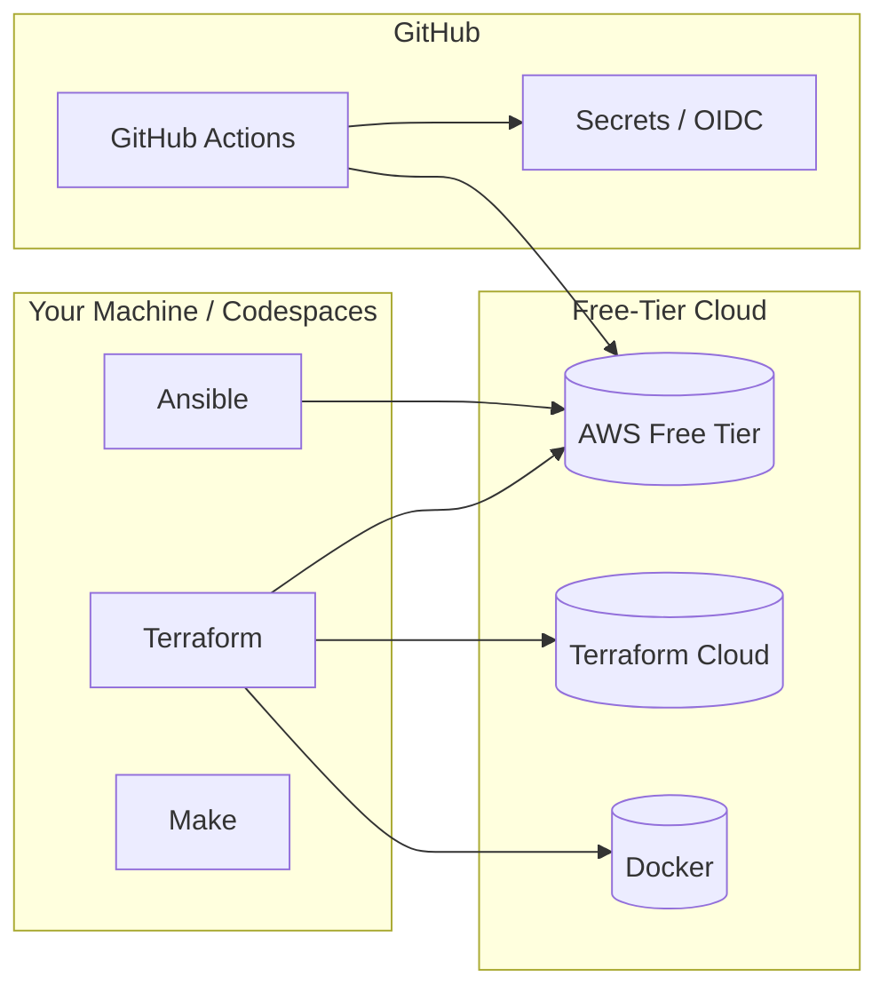

# DevOps Labs: Terraform & Ansible

A hands-on, beginner-friendly learning repository for **Terraform** and **Ansible** — built entirely on **free-tier resources** and **GitHub Actions**.

Each lab lives on its own **Git branch**. Every branch is self-contained: it has its own `README.md`, `Makefile`, code, and CI workflow. You never need to finish one lab to start another, but the labs are ordered so that skills build progressively.

## How to Use This Repository

1. **Fork** this repository (see `CONTRIBUTING.md` if you want to add labs).
2. Pick a lab below and check out its branch:
   ```bash
   git checkout lab-01-docker-provider
   ```
3. Follow the `README.md` on that branch — it contains learning objectives, a diagram, step-by-step instructions, verification, cleanup, and troubleshooting.
4. Every lab has a `Makefile`. Standard targets are:
   | Target    | What it does |
   |-----------|--------------|
   | `setup`   | Install/verify prerequisites |
   | `lint`    | Run linters (tflint, ansible-lint, yamllint) |
   | `test`    | Run tests (validate, molecule, security scans) |
   | `deploy`  | Apply the infrastructure / run the playbook |
   | `destroy` | Tear everything down |
   | `clean`   | Remove local artifacts |

> **Tip:** Use GitHub Codespaces for a zero-install experience. Most labs work out of the box there.

## Learning Roadmap

### Phase 1 — Terraform Fundamentals

- [ ] **Lab 00 — Setup & Tooling Validation** → [`lab-00-setup`](../../tree/lab-00-setup)
  Install Terraform, Ansible, tflint, ansible-lint, checkov, tfsec, Molecule. Validate everything in CI.
- [ ] **Lab 01 — Docker Provider** → [`lab-01-docker-provider`](../../tree/lab-01-docker-provider)
  Deploy a local Nginx container with the `kreuzwerker/docker` provider.
- [ ] **Lab 02 — Variables, Locals & Outputs** → [`lab-02-variables-outputs`](../../tree/lab-02-variables-outputs)
  Parameterize Lab 01 with variables, `locals`, and `tfvars`.
- [ ] **Lab 03 — Modules** → [`lab-03-modules`](../../tree/lab-03-modules)
  Refactor into a reusable `container-service` module; deploy blue/green containers.
- [ ] **Lab 04 — State Backends** → [`lab-04-state-backends`](../../tree/lab-04-state-backends)
  Migrate local state to Terraform Cloud (free tier).

### Phase 2 — Terraform on AWS (Free Tier)

- [ ] **Lab 05 — AWS Free Tier** → [`lab-05-aws-free-tier`](../../tree/lab-05-aws-free-tier)
  VPC, subnet, security group, and a `t2.micro` EC2 instance running Nginx via `user_data`.
- [ ] **Lab 06 — Workspaces** → [`lab-06-workspaces`](../../tree/lab-06-workspaces)
  Manage `dev` and `staging` environments with Terraform workspaces.
- [ ] **Lab 07 — Security Scanning** → [`lab-07-security-scanning`](../../tree/lab-07-security-scanning)
  checkov + tfsec + tflint in CI. Learn to handle findings and suppress false positives.
- [ ] **Lab 08 — Terraform CI/CD** → [`lab-08-terraform-cicd`](../../tree/lab-08-terraform-cicd)
  `plan` on pull requests, `apply` on merge — with AWS OIDC, no stored keys.

### Phase 3 — Ansible Fundamentals

- [ ] **Lab 09 — Ansible Basics** → [`lab-09-ansible-basics`](../../tree/lab-09-ansible-basics)
  Inventory, `ansible.cfg`, and ad-hoc commands.
- [ ] **Lab 10 — Playbooks** → [`lab-10-playbooks`](../../tree/lab-10-playbooks)
  Your first playbook: install Nginx, deploy a page, handlers, idempotence.
- [ ] **Lab 11 — Roles** → [`lab-11-roles`](../../tree/lab-11-roles)
  Refactor the playbook into a `webserver` role. Defaults, vars, templates.
- [ ] **Lab 12 — Molecule Testing** → [`lab-12-molecule-testing`](../../tree/lab-12-molecule-testing)
  Test the role in Docker with Molecule: converge, idempotence, verify.

### Phase 4 — Terraform + Ansible Together

- [ ] **Lab 13 — Terraform → Ansible Integration** → [`lab-13-tf-ansible-integration`](../../tree/lab-13-tf-ansible-integration)
  Terraform writes an inventory file; Ansible configures the EC2 it created.
- [ ] **Lab 14 — Dynamic Inventory** → [`lab-14-dynamic-inventory`](../../tree/lab-14-dynamic-inventory)
  Discover EC2 instances on the fly with the `amazon.aws.aws_ec2` inventory plugin.
- [ ] **Lab 15 — Ansible Vault** → [`lab-15-ansible-vault`](../../tree/lab-15-ansible-vault)
  Encrypt secrets with `ansible-vault`, decrypt in CI with a GitHub Secret.

### Phase 5 — CI/CD & The Capstone

- [ ] **Lab 16 — Ansible CI/CD** → [`lab-16-ansible-cicd`](../../tree/lab-16-ansible-cicd)
  Lint and molecule-test on PRs; deploy on merge.
- [ ] **Lab 17 — Full DevOps Pipeline** → [`lab-17-full-devops-pipeline`](../../tree/lab-17-full-devops-pipeline)
  The capstone: Terraform apply (OIDC) → Ansible configure → smoke test → cleanup.

## Architecture Overview



## Prerequisites

- A GitHub account (free)
- One of:
  - **GitHub Codespaces** (easiest — no local installs), or
  - A local machine with Git, and per-lab tools installed via each lab's `make setup`
- Free cloud accounts where labs require them (AWS, Terraform Cloud) — each lab README says exactly what to create and warns about free-tier limits

## Cost Warning

Everything here is designed to fit within free tiers, but **cloud free tiers change**. Always:

1. Read the "Free Tier Notes" section in each lab README.
2. Run `make destroy` (or `terraform destroy`) when done.
3. Check the AWS Billing console after each lab.

## Contributing

See [CONTRIBUTING.md](CONTRIBUTING.md) for branch naming, commit conventions, and how to add a new lab.

## License

MIT — use it, fork it, teach with it.
