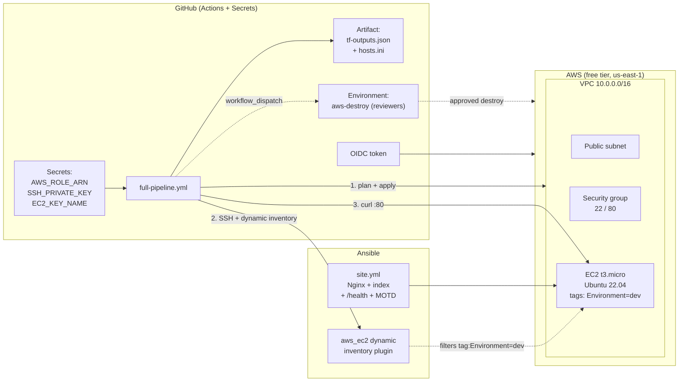

# Lab 17 — Full DevOps Pipeline: Terraform + Ansible + GitHub Actions (Capstone)

This is the capstone lab. It combines everything from the previous labs into one continuous, push-button pipeline: Terraform provisions a free-tier AWS environment (Lab 05), tags it `Environment=dev` (Lab 14), renders an Ansible inventory with a `local_file` resource (Lab 13), and a GitHub Actions workflow then wires three jobs together with `needs:` — Terraform apply, Ansible configuration via a **dynamic AWS inventory plugin**, and an HTTP smoke test — plus a manually gated `destroy` job for safe cleanup. Locally, a Makefile mirrors the exact same flow.

## Learning Objectives

- Chain GitHub Actions jobs with `needs:` so infrastructure exists before configuration, and configuration finishes before testing.
- Authenticate to AWS from GitHub Actions using **OIDC** (short-lived tokens), never long-lived access keys.
- Use the `amazon.aws.aws_ec2` **dynamic inventory plugin** instead of a static inventory file, filtering by Terraform tags.
- Pass data between jobs: `terraform output` → job `outputs` → downstream jobs, plus a build **artifact**.
- Gate a destructive job behind a GitHub **Environment with required reviewers**.
- Mirror a CI pipeline locally with a Makefile (`all`, `deploy`, `smoke-test`, `destroy`).

## Architecture



### The pipeline job graph

```mermaid
flowchart TD
    T["terraform<br/>OIDC auth, fmt, validate,<br/>plan, apply, output,<br/>upload artifact"]
    A["ansible<br/>needs: terraform<br/>install ansible + collections,<br/>playbook vs dynamic inventory"]
    S["smoke-test<br/>needs: ansible (+ terraform)<br/>curl --fail --retry :80 /health"]
    D["destroy<br/>workflow_dispatch ONLY<br/>environment: aws-destroy<br/>(required reviewers)"]

    T --> A --> S
    T -. outputs.public_ip .-> S
    D -. "manual cleanup,<br/>independent of other jobs" .-> T
```

### How data flows between jobs

1. **`terraform` job** runs `terraform output -raw public_ip` into a step output, and also `terraform output -json > tf-outputs.json`. Both the JSON and the Terraform-generated `ansible/inventory/hosts.ini` are uploaded as the `terraform-outputs` artifact.
2. The **`ansible` job** declares `needs: terraform`, downloads the artifact (available for inspection / as a static fallback), but actually runs the playbook against the **dynamic inventory** `inventory/aws_ec2.yml`, which queries the AWS API for running instances tagged `Environment=dev`.
3. The **`smoke-test` job** declares `needs: [terraform, ansible]`, so it can read `needs.terraform.outputs.public_ip` directly — no parsing, no SSH.
4. The **`destroy` job** has **no `needs:`** on purpose: it must be able to tear resources down even when the build jobs failed halfway, and it only runs on `workflow_dispatch` after a reviewer approves the `aws-destroy` environment.

### Secrets pattern (no Vault in this lab)

- **GitHub Actions**: `AWS_ROLE_ARN`, `SSH_PRIVATE_KEY`, and `EC2_KEY_NAME` live in repo Secrets. The private key is written to an ephemeral runner file (`~/.ssh/id_rsa`, mode `600`) and disappears with the runner.
- **No Ansible Vault is needed** — the play stores no secrets. If you extend it with secrets, the pattern is: store the vault password in a GitHub Secret, then run `ansible-playbook --vault-password-file <(echo "$VAULT_PASSWORD") ...` (or write it to a temp file and delete it in the same step). Never commit a `.vault_pass` file — it is in `.gitignore` for exactly that reason.

## Prerequisites

**Accounts**

- A free AWS account (12-month free tier is fine).
- A free GitHub account and a repository for this lab.

**Tools (local runs; CI only needs the YAML + secrets)**

| Tool | Version | Check with |
| --- | --- | --- |
| Terraform | >= 1.5.0 | `terraform version` |
| Ansible (core) | >= 2.15 | `ansible --version` |
| Python | >= 3.10 (with `pip`) | `python --version` |
| boto3 + botocore | latest (dynamic inventory) | `pip install boto3 botocore` |
| AWS CLI | 2.x | `aws --version` |
| jq | any recent | `jq --version` |
| make + curl | any | `make --version`, `curl --version` |

On Windows use Git Bash (bundled with Git for Windows) for the Makefile targets.

**Environment variables (local runs)**

| Variable | Purpose | Example |
| --- | --- | --- |
| `AWS_ACCESS_KEY_ID` / `AWS_SECRET_ACCESS_KEY` / `AWS_SESSION_TOKEN` | AWS auth for Terraform, dynamic inventory, AWS CLI | from `aws configure` / `aws sso login` |
| `AWS_REGION` | Region override (default `us-east-1`) | `us-east-1` |
| `TF_VAR_key_name` | Name of an **existing** AWS EC2 key pair | `my-lab-key` |

**AWS setup (once)**

1. Create an EC2 key pair in the console, download the private key, and place it at `~/.ssh/id_rsa` (mode `600`).
2. Create an IAM OIDC identity provider for `token.actions.githubusercontent.com` (audience `sts.amazonaws.com`) and an IAM role trustable by it. Trust policy sketch:

   ```json
   {
     "Version": "2012-10-17",
     "Statement": [{
       "Effect": "Allow",
       "Principal": {
         "Federated": "arn:aws:iam::<ACCOUNT_ID>:oidc-provider/token.actions.githubusercontent.com"
       },
       "Action": "sts:AssumeRoleWithWebIdentity",
       "Condition": {
         "StringEquals": {
           "token.actions.githubusercontent.com:aud": "sts.amazonaws.com",
           "token.actions.githubusercontent.com:sub": "repo:<OWNER>/<REPO>:ref:refs/heads/main"
         }
       }
     }]
   }
   ```

   Attach a policy allowing EC2/VPC management in `us-east-1` (e.g. PowerUserAccess scoped down for a lab).
3. In GitHub: **Settings → Secrets and variables → Actions**, add `AWS_ROLE_ARN` (the role ARN), `SSH_PRIVATE_KEY` (full private key contents), and `EC2_KEY_NAME` (the key pair name from step 1).
4. Optional but recommended for the gated destroy: **Settings → Environments → New environment** named `aws-destroy`, add **required reviewers** (yourself). The workflow already references this environment; without reviewers configured the job still runs, but nothing stops you.

## Step-by-Step Instructions

### A. Run the pipeline in GitHub Actions

1. Push this lab to a branch and open a PR, or push directly to `main`.
2. Go to the **Actions** tab → **full-pipeline** → watch the jobs run in order: `terraform` → `ansible` → `smoke-test`. Expected highlights:

   ```text
   terraform:  Apply complete! Resources: 8 added, 0 changed, 0 destroyed.
   terraform:  public_ip = 54.123.45.67
   ansible:    TASK [Ensure Nginx is enabled and running] ... changed: [54.123.45.67]
   smoke-test: <h1>Hello from the Lab 17 full DevOps pipeline!</h1>
   smoke-test: ok
   ```

3. Or trigger it manually: **Actions → full-pipeline → Run workflow** (this also enables the `destroy` job, see Cleanup).

### B. Run the same pipeline locally

```bash
# 1. One-time setup: providers + Ansible collections
make setup

# 2. Provide your AWS credentials and key pair name
export AWS_ACCESS_KEY_ID=... AWS_SECRET_ACCESS_KEY=... AWS_REGION=us-east-1
export TF_VAR_key_name=my-lab-key

# 3. Lint everything (fmt, validate, ansible-lint if installed)
make lint

# 4. Full local pipeline: terraform apply + ansible playbook + smoke test
make all
```

Expected output ends with:

```text
Smoke-testing http://54.123.45.67/
<h1>Hello from the Lab 17 full DevOps pipeline!</h1>
ok
```

### C. Watch the dynamic inventory in action

```bash
ansible-inventory -i ansible/inventory/aws_ec2.yml --list | jq '."tag_Environment_dev".hosts'
ansible-inventory -i ansible/inventory/aws_ec2.yml --graph
```

You should see your instance's public IP listed under the auto-created `tag_Environment_dev` group — with **no IP hardcoded anywhere** in the repo.

## How Do I Know This Worked?

| Check | Command | Success looks like |
| --- | --- | --- |
| All workflow jobs green | Actions tab | ✅ terraform ✅ ansible ✅ smoke-test |
| Web page serves | `make smoke-test` or open `http://$(cd terraform && terraform output -raw public_ip)/` | HTML page with "Hello from the Lab 17 full DevOps pipeline!" |
| Health endpoint | `curl http://<IP>/health` | body: `ok` |
| SSH MOTD | `ssh -i ~/.ssh/id_rsa ubuntu@<IP>` | "Lab 17 capstone server — managed by Terraform + Ansible." banner |
| Dynamic inventory resolves | `make ping` | `54.x.x.x \| SUCCESS => { "ping": "pong" }` |
| Instance tagged correctly | `aws ec2 describe-instances --filters Name=tag:Environment,Values=dev --query 'Reservations[].Instances[].InstanceId'` | returns your instance ID |

## Cleanup

**Option 1 — local (fastest while you are experimenting):**

```bash
make destroy     # terraform destroy -auto-approve; removes every AWS resource
```

Confirm with:

```bash
aws ec2 describe-instances --filters Name=tag:Environment,Values=dev \
  --query 'Reservations[]' --output text   # -> empty
```

**Option 2 — CI destroy (the "safe" path, recommended for shared repos):**

1. **Actions → full-pipeline → Run workflow** (manual dispatch).
2. Wait for the `destroy` job to reach the `aws-destroy` environment gate and **approve it** (required reviewers).
3. The job runs `terraform init` + `terraform destroy -auto-approve` with OIDC credentials. Because the job has no `needs:`, it works even if `terraform`/`ansible` jobs failed and left orphans.

## Troubleshooting

**1. `Error: Could not assume role with OIDC` in the terraform job**
- *Symptom:* the `Authenticate to AWS with OIDC` step fails with an assume-role error.
- *Cause:* the IAM role's trust policy does not match the repo — wrong `sub` claim (`repo:OWNER/REPO:ref:refs/heads/main` vs the branch you pushed), wrong audience, or the OIDC provider does not exist in the account.
- *Fix:* re-check the trust policy in the Prerequisites against your actual owner/repo/branch (workflow dispatches use the same `sub` for the default branch). Add the repo's thumbprint (`6938fd4d98bab03faadb97b34396831e3780aea1`) to the provider if it is missing.

**2. Ansible reports "No inventory was parsed" or `skipping: no hosts matched`**
- *Symptom:* the ansible job fails before running any task, or the playbook matches zero hosts.
- *Cause:* the `amazon.aws` collection or `boto3` is not installed, AWS credentials are missing (the dynamic inventory calls `DescribeInstances`), the region differs from Terraform's, or the instance does not carry the `Environment=dev` tag yet (timing — the instance may still be in `pending` state; the plugin filters on `instance-state-name: running`).
- *Fix:* confirm `pip install ansible boto3 botocore` and `ansible-galaxy collection install -r ansible/requirements.yml` ran, that the OIDC step precedes the playbook, and re-run — instance state and tags are settled by the time `needs: terraform` completes in practice. Locally, run `make ping` to debug the inventory alone.

**3. Smoke test fails with `Connection refused` even though Ansible succeeded**
- *Symptom:* `curl --fail ... http://<IP>/` retries 10 times and still fails.
- *Cause:* the security group does not allow inbound TCP 80 from `0.0.0.0/0`, Nginx failed to start (check `systemctl status nginx` over SSH), or — in CI — the `smoke-test` job cannot read the IP because `terraform` was not listed in its `needs:` (job outputs are only visible to direct dependents).
- *Fix:* verify port 80 ingress in `terraform/main.tf`, SSH in and check Nginx, and make sure the workflow declares `needs: [terraform, ansible]` on the smoke-test job (this lab's workflow already does).

## Free Tier Notes

- This lab creates exactly **one `t3.micro`** (free tier: 750 hours/month for 12 months), one small VPC/subnet/IGW/security group, and a dynamic public IP — all free. Data transfer out is free up to 15 GB/month; a few `curl` smoke tests use kilobytes.
- **Free tiers change.** Before running anything, check the current AWS Free Tier page for your account type, and afterwards check **Billing → Cost Explorer** to confirm $0 (or near-$0) spend.
- The biggest free-tier risk is forgetting the instance running: at ~730 hours/month, one instance is fine, but **two** instances or leftovers from other labs can exceed the allowance.
- Always finish with `make destroy` (or the gated CI destroy). Left-running resources are the #1 cause of surprise bills.
- Re-running the pipeline repeatedly is fine — Terraform is idempotent, so applies cost nothing extra beyond the running instance time.
