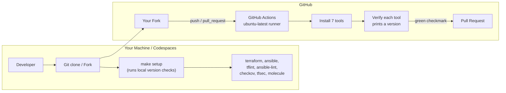

# Lab 00 — Environment Setup & Toolchain Validation

Welcome! This is the very first lab in the **devops-labs-terraform-ansible** series. Before we
build anything with Terraform or configure anything with Ansible, we need to make sure your
development environment has all the tools we will use throughout the course — and that each tool
is a recent enough version. This lab validates your toolchain in two ways: **automatically in
GitHub Actions** (runs on every push and pull request) and **locally** with a single `make setup`
command.

> **What this lab does NOT do:** it does not create, deploy, or cost you a single cloud resource.
> It only installs and version-checks software.

## Learning Objectives

By the end of this lab you will be able to:

- Fork a GitHub repository and open it in **GitHub Codespaces** (or a local clone).
- Explain what each tool in the toolchain does: Terraform, Ansible, tflint, ansible-lint,
  checkov, tfsec, and Molecule.
- Validate your toolchain locally with `make setup`.
- Read and understand a GitHub Actions workflow (`.github/workflows/setup.yml`) that installs
  and verifies the same tools in CI.
- Confirm that the green ✅ checkmark on your pull request means "your environment is ready".

## Architecture

Nothing is deployed in this lab. The diagram below shows the components involved: your fork of
the repo, the CI runner that validates the toolchain, and your local machine.



## Prerequisites

You have **two options** for completing the labs. Both work; pick one.

### Option A — GitHub Codespaces (recommended, zero local installs)

- A **free GitHub account** (github.com/join). Free accounts include a monthly quota of
  Codespaces hours — this lab uses only minutes.
- A browser. That is it.

### Option B — Local machine

| Tool     | Minimum version | How to install (pick one)                                    |
|----------|-----------------|--------------------------------------------------------------|
| Git      | 2.40+           | [git-scm.com](https://git-scm.com/downloads)                 |
| GNU Make | 3.81+           | `sudo apt install make` / `choco install make` / Xcode CLT   |
| Python   | 3.10+           | [python.org](https://www.python.org/downloads/)              |
| pipx     | 1.2+            | `python -m pip install --user pipx` then `pipx ensurepath`  |

The remaining tools (Terraform, tflint, ansible, ansible-lint, checkov, tfsec, molecule) will be
installed **by the Makefile itself** via `pipx` and official release downloads — you do not need
to install them by hand.

**Required environment variables:** none for this lab. Later labs will require cloud credentials
such as `AWS_ACCESS_KEY_ID` — not here.

## Step-by-Step Instructions

### 1. Fork the repository

1. Log in to GitHub and open the original repository.
2. Click **Fork** (top-right) → keep the default name → **Create fork**.

### 2a. Open the fork in GitHub Codespaces (one click)

1. Open **your fork** in the browser.
2. Press the `.` (period) key on your keyboard.

   > Pressing `.` is the GitHub shortcut that opens the repository in the
   > **github.dev web editor**. From there, press `Ctrl+Shift+P` (or `Cmd+Shift+P` on macOS),
   > type `Create New Codespace`, and hit Enter. Alternatively, click the green **Code** button →
   > **Codespaces** tab → **Create codespace on main**. A Codespace is a full Linux container in
   > the cloud with everything needed to run the labs — no local installation required.

3. Wait 1–2 minutes while the Codespace builds. You now have a VS Code-like editor running in
   your browser, with a terminal at the bottom.

### 2b. Or clone locally

```bash
git clone https://github.com/YOUR-USERNAME/devops-labs-terraform-ansible.git
cd devops-labs-terraform-ansible
```

### 3. Validate the toolchain locally

```bash
make setup
```

Expected output (versions will vary slightly — that is fine as long as each command prints a
version and no command says "command not found"):

```
==> Lab 00: validating local toolchain...
Terraform v1.9.x
ansible [core 2.16.x]
tflint version 0.5x.x
ansible-lint 24.x.x using ansible-core:2.16.x
checkov 3.x.x
v1.28.x
molecule 24.x.x using python 3.12.x
==> All 7 tools are installed and on PATH. Toolchain OK.
```

If any tool is missing, the Makefile installs it for you (via `pipx` and the official Terraform
and tflint installers), then re-runs the checks.

### 4. Watch CI validate the same tools

```bash
git checkout -b lab-00-setup
git add -A
git commit -m "lab 00: toolchain validation"
git push origin lab-00-setup
```

Then open your fork on GitHub → **Pull requests** → **New pull request** → base `main`, compare
`lab-00-setup` → **Create pull request**. The **Setup / validate** workflow runs automatically,
installs all seven tools on an `ubuntu-latest` runner, and prints each version.

You can also see it run on every push under the **Actions** tab.

## How Do I Know This Worked?

- Locally: `make setup` finishes with `==> All 7 tools are installed and on PATH. Toolchain OK.`
- In CI: the pull request shows a green ✅ next to the **validate-toolchain** job; clicking it
  shows each tool's version in the "Verify tool versions" step log:

```
Run for tool in terraform ansible tflint ansible-lint checkov tfsec molecule; do
  echo "::group::$tool"
  terraform version
  ansible --version
  tflint --version
  ansible-lint --version
  checkov --version
  tfsec --version
  molecule --version
  echo "::endgroup::"
done
```

- Quick spot-check of any single tool:

```bash
terraform version
# Terraform v1.9.x ...  <- a version string, not "command not found"
```

## Cleanup

This lab creates **no cloud resources**, so there is nothing to tear down and **nothing that can
cost you money**. To clean up your local environment (or the Codespace):

- **Codespaces:** in your fork on GitHub → **Code** → **Codespaces** → ⋯ menu on your Codespace →
  **Delete**. This stops the billing meter (free-tier quota usage).
- **Local clone (optional):** remove the tools the Makefile installed:

```bash
pipx uninstall ansible ansible-lint molecule checkov 2>/dev/null
# terraform / tflint, if installed via the Makefile's default paths:
sudo rm -f /usr/local/bin/terraform /usr/local/bin/tflint
rm -f "$HOME/bin/tfsec"
```

- **Fork (optional):** keep it — all labs build on it.

## Troubleshooting

1. **`make: command not found`**
   - **Symptom:** Running `make setup` prints `make: command not found` (or `'make' is not
     recognized`).
   - **Cause:** GNU Make is not installed. On Windows it ships with Git Bash but is not on PATH;
     on macOS it needs Xcode Command Line Tools.
   - **Fix:** Install it — `sudo apt install make` (Linux), `xcode-select --install` (macOS),
     or run the steps inside a **GitHub Codespace**, where `make` is preinstalled.

2. **`pipx: command not found` when running `make setup`**
   - **Symptom:** The setup fails at an install step saying `pipx: command not found`.
   - **Cause:** `pipx` is installed but its bin directory is not on your shell's PATH, or pipx
     was never installed.
   - **Fix:** Run `python3 -m pip install --user pipx && pipx ensurepath`, then open a **new
     terminal** (PATH changes only take effect in new shells) and re-run `make setup`.

3. **CI job fails at `tfsec --version` with "command not found"**
   - **Symptom:** The GitHub Actions log shows everything except `tfsec` working.
   - **Cause:** `tfsec` is installed by downloading a release binary to `$HOME/bin`; if the
     workflow's PATH setup was changed, `$HOME/bin` may not be on PATH.
   - **Fix:** The workflow adds `$HOME/bin` to `GITHUB_PATH` before the verify step. If you
     edited the workflow, ensure that step runs **before** the version-check loop, then re-push.

4. **`fatal: detected dubious ownership in repository` (WSL)**
   - **Symptom:** Any `git` command inside WSL fails when the repo lives on a Windows drive
     (`/mnt/c/...`), because the folder is owned by your Windows user, not the WSL user.
   - **Cause:** Git's safe.directory protection treats the foreign-owned repo as untrusted.
   - **Fix:** Tell Git to trust it once:
     ```bash
     git config --global --add safe.directory /mnt/c/Users/ayoub/Desktop/devops-labs-terraform-ansible
     ```
     (Use `'*'` instead of the path to trust all your repos — fine on a personal machine.)

## Free Tier Notes

- **This lab provisions zero cloud resources** — there is no AWS, Azure, or GCP usage, so there
  is no bill to worry about yet.
- **GitHub Actions:** free for public repositories (2,000 minutes/month on free private repos).
  This workflow takes ~3 minutes per run.
- **GitHub Codespaces:** free accounts get a monthly quota of core-hours and storage; deleting
  the Codespace (see Cleanup) stops any quota consumption.
- **Free tiers and quotas change over time.** Always run the Cleanup section, then check
  [GitHub Billing](https://github.com/settings/billing) (and your cloud billing console in later
  labs) after finishing.
