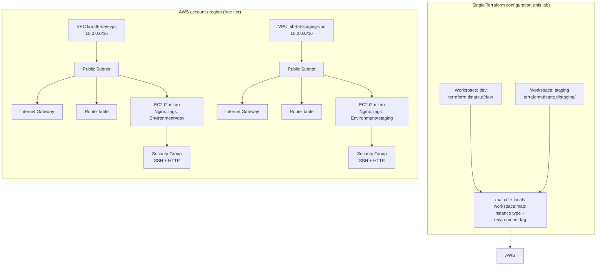

# Lab 06 — Terraform Workspaces (Dev + Staging from One Codebase)

This lab takes the exact AWS stack built in Lab 05 (VPC, public subnet,
internet gateway, route table, security group allowing SSH + HTTP, an SSH key
pair, and a `t2.micro` EC2 instance running Nginx via `user_data`) and makes
it **multi-environment with Terraform workspaces**. Instead of copying the
configuration into `dev/` and `staging/` folders, a single map of locals keyed
by `terraform.workspace` decides the instance settings and tags, and every
resource name embeds the workspace — so one `terraform apply` in the `dev`
workspace and another in the `staging` workspace produce two completely
isolated environments from the same code.

## Learning Objectives

- Explain what a Terraform workspace is and how per-workspace state files work.
- Create and switch between workspaces with `terraform workspace new/select/list`.
- Drive configuration differences (instance type, tags) through a
  `terraform.workspace`-keyed map in `locals`.
- Name resources with `${terraform.workspace}` so environments never collide.
- Use the local backend and understand how to migrate to a remote (S3) backend later.
- Verify isolation by comparing outputs, tags, and HTTP responses per workspace.

## Architecture



Both VPCs can use the same CIDR (`10.0.0.0/16`) because they are separate
VPCs — workspaces isolate the *state*, and the workspace-prefixed names
isolate the *resources*.

## Prerequisites

| Tool / Account | Version | Notes |
| --- | --- | --- |
| Terraform | >= 1.5.0 (`terraform version`) | Workspaces are a built-in, free feature |
| AWS CLI | >= 2.x (`aws --version`) | Optional but recommended |
| AWS account | Free tier | With programmatic access enabled |
| SSH key pair | any | Generate with `ssh-keygen -t ed25519` if you don't have one |

Environment variables that must be set (never hardcode them in files):

```bash
export AWS_ACCESS_KEY_ID="AKIA..."        # your IAM user access key
export AWS_SECRET_ACCESS_KEY="..."        # your IAM user secret key
export AWS_DEFAULT_REGION="us-east-1"     # optional; defaults to us-east-1
export TF_VAR_ssh_public_key="ssh-ed25519 AAAA..."   # your PUBLIC key, one line
```

The IAM user needs permissions to manage VPC, EC2, and key pairs
(`AmazonEC2FullAccess` + `AmazonVPCFullAccess` is simplest for a lab; use a
least-privilege policy in real life).

## Step-by-Step Instructions

1. **Check your tools:**

   ```bash
   terraform version    # >= 1.5.0
   aws sts get-caller-identity   # confirms your credentials work
   ```

   Expected output: a version string, then an ARN/account JSON block.

2. **Set the environment variables** listed in Prerequisites (all four).

3. **Initialize Terraform:**

   ```bash
   terraform init
   ```

   Expected output ending with: `Terraform has been successfully initialized!`

4. **Create the two workspaces:**

   ```bash
   terraform workspace new dev
   terraform workspace new staging
   ```

   Expected output:

   ```
   Created and switched to workspace "dev"!
   ...
   Created and switched to workspace "staging"!
   ```

5. **List workspaces and switch to dev:**

   ```bash
   terraform workspace list
   terraform workspace select dev
   ```

   Expected output:

   ```
   default
   * dev
     staging
   Switched to workspace "dev".
   ```

6. **Deploy the dev environment:**

   ```bash
   terraform plan -out=tfplan-dev
   terraform apply tfplan-dev
   ```

   Expected: `Apply complete! Resources: 8 added, 0 changed, 0 destroyed.`
   plus outputs like `instance_public_ip = "54.x.x.x"` and
   `environment = "dev"`.

7. **Deploy the staging environment — same code, one command different:**

   ```bash
   terraform workspace select staging
   terraform plan -out=tfplan-staging
   terraform apply tfplan-staging
   ```

   Expected: another `Apply complete!`, but this time the outputs show
   `environment = "staging"` and a **different** public IP. In the AWS console
   you will now see `lab-06-dev-vpc` and `lab-06-staging-vpc`,
   `lab-06-dev-web` and `lab-06-staging-web`, etc.

8. **Inspect the per-workspace state files** (proof of isolation):

   ```bash
   ls terraform.tfstate.d/dev/ terraform.tfstate.d/staging/
   ```

   Expected: each directory contains its own `terraform.tfstate`.

## How Do I Know This Worked?

- **Different IPs per workspace** — after each apply, run
  `terraform output instance_public_ip`. The dev and staging values must differ:

  ```bash
  terraform workspace select dev     && terraform output instance_public_ip
  terraform workspace select staging && terraform output instance_public_ip
  ```

- **Nginx page echoes the workspace:**

  ```bash
  terraform workspace select dev
  curl http://$(terraform output -raw instance_public_ip)
  # <p>Workspace: dev</p>

  terraform workspace select staging
  curl http://$(terraform output -raw instance_public_ip)
  # <p>Workspace: staging</p>
  ```

- **Tags differ in the AWS console / CLI:**

  ```bash
  terraform workspace select dev
  aws ec2 describe-instances \
    --instance-ids $(terraform output -raw instance_id) \
    --query 'Reservations[].Instances[].Tags'
  # includes {"Key": "Environment", "Value": "dev"} and {"Key": "Name", "Value": "lab-06-dev-web"}
  ```

- **Destroying one workspace leaves the other running:** apply both, then run
  the Cleanup steps for `staging` only; `curl` the dev IP and it still serves.

## Cleanup

Destroy **each** workspace separately — destroying one does not touch the other:

```bash
terraform workspace select staging
terraform destroy          # type 'yes' when prompted

terraform workspace select dev
terraform destroy          # type 'yes' when prompted

# Optional: remove the workspaces themselves and all local state
terraform workspace select default
terraform workspace delete dev
terraform workspace delete staging
rm -rf .terraform terraform.tfstate.d
```

Or with the Makefile: `make destroy` then `make destroy WORKSPACE=staging`,
then `make clean`.

## Troubleshooting

1. **Error: `No valid credential sources found` (on plan/apply)**
   - *Symptom:* `terraform plan` fails immediately with an authentication error.
   - *Cause:* `AWS_ACCESS_KEY_ID` / `AWS_SECRET_ACCESS_KEY` are unset, expired, or typo'd.
   - *Fix:* Re-export the variables from Prerequisites and confirm with
     `aws sts get-caller-identity` before retrying.

2. **Error: `Workspace "staging" doesn't exist` (on `terraform workspace select staging`)**
   - *Symptom:* select fails even though you "created" the workspace earlier.
   - *Cause:* Workspaces live in the local backend directory
       (`terraform.tfstate.d/`) of the machine you ran `init` on — a fresh
       clone or `make clean` wipes them, or you created it in a different directory.
     - *Fix:* Recreate it: `terraform workspace new staging`, then re-apply.

3. **Error: `Error creating KeyPair: InvalidKeyPair.Duplicate` (or similar `AlreadyExists` on apply)**
   - *Symptom:* apply fails creating `lab-06-<workspace>-key`.
   - *Cause:* You applied in the `default` workspace too — `default` gets
     dev-like settings from the `lookup()` fallback, so its names collide with
     the real `dev` workspace.
   - *Fix:* Only use named workspaces: run
     `terraform workspace select dev && terraform destroy` while in the
     `default` workspace to remove the colliding resources, then switch to
     `dev` and re-apply.

## Free Tier Notes

- `t2.micro` is free-tier eligible (750 hours/month) in all regions;
  `t3.micro` is only free-tier in some regions, which is why both workspaces
  here stick to `t2.micro`. You will have **two instances running** (dev +
  staging) — their combined usage counts against the same 750-hour monthly
  allowance, so stop or destroy them when not experimenting.
- The VPC, subnet, internet gateway, and route table are free. Each instance
  creates an 8 GiB EBS root volume (30 GiB/month of general-purpose SSD is
  free).
- Public IPs assigned to running instances are free; **Elastic IPs left
  unattached cost money** — this lab does not create any.
- Free tiers change over time: always run the Cleanup section and check the
  AWS Billing console after finishing the lab.
- Terraform workspaces and the local backend are free Terraform CLI features.
  If you later migrate state to S3, the S3 bucket itself is outside the AWS
  free tier (negligible cost for a lab, but not zero).
