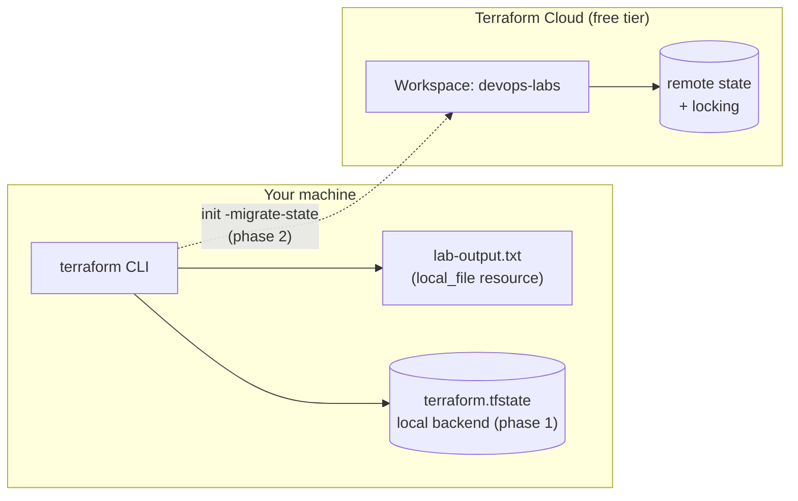

# Lab 04 — Terraform State Backends: Local to Terraform Cloud

Terraform keeps a record of every resource it manages in a **state file**. By
default that file is a plain `terraform.tfstate` on your laptop — convenient,
but it cannot be shared with a team, has no locking, and disappears if your
disk does. In this lab you will create one trivial resource, inspect its local
state, and then **migrate that state to Terraform Cloud's free tier** so it is
stored remotely with locking and versioning. You will also migrate back, so
you understand both directions.

## Learning Objectives

- Explain what Terraform state is and why it must never be edited by hand.
- Inspect state with `terraform state list` and `terraform show`.
- Configure the `local` backend explicitly versus relying on the default.
- Configure the `remote` backend pointing at Terraform Cloud.
- Migrate state between backends with `terraform init -migrate-state`.
- Verify that state really landed in Terraform Cloud's UI.

## Architecture

The lab creates a single local file and records it in a state backend. The
diagram shows both phases of the lab.



## Prerequisites

| Tool / Account | Version / Details |
| --- | --- |
| Terraform CLI | >= 1.5.0 (`terraform version` to check) |
| Git Bash (Windows) or any POSIX shell | for the `Makefile` |
| Terraform Cloud account | free tier — sign up at https://app.terraform.io |
| Web browser | to create the org/workspace and verify state |
| Environment variables | **None required** — no cloud credentials are used in this lab |

A Terraform Cloud **API token** is created interactively by
`terraform login` during the lab — you do not need to export it manually.

> Before you start, clone/download this lab and `cd` into
> `staging/lab-04-state-backends` (or wherever you placed these files).

## Step-by-Step Instructions

### Phase 0 — apply with the local backend (default)

1. Verify your setup:

   ```bash
   make setup
   ```

   Expected: prints the Terraform version and `Setup OK.`.

2. Initialize and apply. The active `backend "remote"` block in `backend.tf`
   would demand Terraform Cloud credentials already, so for this first phase
   **temporarily comment out the remote block** (and optionally uncomment the
   `backend "local"` block — no backend block at all also means "local"):

   ```hcl
   # backend.tf, phase 0/1 state:
   # backend "local" {
   #   path = "terraform.tfstate"
   # }
   # backend "remote" { ... }   <-- everything in this block commented out
   ```

   Then run:

   ```bash
   terraform init
   terraform apply
   ```

   Expected output (abridged):

   ```
   Plan: 1 to add, 0 to change, 0 to destroy.
   ...
   Apply complete! Resources: 1 added, 0 changed, 0 destroyed.
   ```

3. Confirm the resource exists in **local** state:

   ```bash
   make test        # terraform state list
   ```

   Expected:

   ```
   local_file.lab_state_demo
   ```

   You can also look at `terraform.tfstate` with `terraform show` — notice the
   file contains your resource and is **not** in git (see `.gitignore`).

### Phase 1 — prepare Terraform Cloud

4. Sign up for the Terraform Cloud **free** tier at https://app.terraform.io
   (choose the free "HCP Terraform / Terraform Cloud" organization type when
   asked).

5. Create an organization named `devops-labs` (any name works — you will paste
   it into `backend.tf`).

6. In that organization, create a workspace named `devops-labs`
   (choose the "CLI-driven workflow" type if prompted).

7. Authenticate the CLI:

   ```bash
   terraform login
   ```

   Expected: your browser opens, you confirm, and the CLI prints
   `Retrieved token for <user>` and stores it in `~/.terraform.d/credentials.tfrc.json`.

### Phase 2 — migrate to the remote backend

8. Edit `backend.tf`:

   - Replace `organization = "your-org"` with your real organization name
     (e.g. `organization = "devops-labs"`).
   - Comment out the `backend "local"` block (if you uncommented it) and make
     sure the `backend "remote"` block is active — that is how the file ships.

9. Migrate the state:

   ```bash
   terraform init -migrate-state
   ```

   Terraform detects the backend change and asks:

   ```
   Do you want to copy existing state to the new backend?
     Existing state will be removed once it is copied. Enter "yes" to copy.
   ```

   Type `yes` and press Enter.

   Expected: `Terraform has been successfully initialized!` and
   `Acquiring state lock. This may take a few moments...` — the lock is the
   remote backend doing its job.

10. Verify nothing was lost:

    ```bash
    make test
    ```

    Expected (same resource as before):

    ```
    local_file.lab_state_demo
    ```

11. Confirm in the Terraform Cloud UI: open your workspace → **States** tab.
    You should see a new state version containing
    `local_file.lab_state_demo`, tagged with your username. State now lives in
    Terraform Cloud — your local `terraform.tfstate` is gone (or backed up as
    `terraform.tfstate.backup` if it existed).

### Phase 3 (optional) — migrate back to local

12. Edit `backend.tf`: comment out the whole `backend "remote"` block and
    uncomment `backend "local"`.

13. Run:

    ```bash
    terraform init -migrate-state
    ```

    Answer `yes`. Your state is copied back into `terraform.tfstate` locally.

## How Do I Know This Worked?

- `terraform state list` prints `local_file.lab_state_demo` **after**
  migration (step 10) — nothing was lost during the move.
- The Terraform Cloud workspace's **States** tab shows a state entry after
  step 9, and a *lock* appears there while any `terraform` command runs.
- `terraform show` works identically in both phases — only storage changed.
- `make lint` passes (fmt + validate) without any cloud credentials.
- `lab-output.txt` exists in the lab directory and contains
  `Managed by Terraform lab-04-state-backends...`.

## Cleanup

```bash
terraform destroy          # deletes local_file.lab_state_demo
```

Then, depending on where state currently lives:

- **If state is remote**: go to the Terraform Cloud UI → your workspace →
  **Settings → Destruction and Deletion → Delete workspace**. A workspace
  without resources costs nothing, but deleting it removes all state history.
  Also remove the local CLI token if you like:
  `rm ~/.terraform.d/credentials.tfrc.json`.
- **If state is local**: it is already ignored by git; `make clean` removes
  `.terraform/` and the lock file. Delete `terraform.tfstate*` and
  `lab-output.txt` if you want a fully clean directory.

## Troubleshooting

1. **Error: `Required token could not be found` / `terraform login` browser
   never opens**
   - *Symptom:* `terraform init` against the remote backend fails asking for a
     token.
   - *Cause:* No valid Terraform Cloud API token is cached on this machine.
   - *Fix:* Run `terraform login` (step 7) and complete the flow in the
     browser. In headless environments, create a token in the UI under
     **User Settings → Tokens** and paste it at the prompt.

2. **Error: `organization "your-org" not found` or `workspace not found`**
   - *Symptom:* init fails with a 404 or "resource not found" mentioning the
     organization or workspace.
   - *Cause:* `backend.tf` still contains the placeholder `your-org`, or the
     workspace name in `workspaces { name = ... }` does not exist in that
     organization.
   - *Fix:* Replace `your-org` with your real organization name (exact,
     case-sensitive) and create the `devops-labs` workspace in the UI, or
     change `name` to match an existing workspace.

3. **Error: `Backend configuration changed` with a prompt to migrate, when you
   only wanted to reconfigure**
   - *Symptom:* `terraform init` asks `Do you want to copy existing state...?`
     unexpectedly, or refuses because a state already exists in the new backend.
   - *Cause:* The backend block in `backend.tf` no longer matches the backend
     recorded in `.terraform/terraform.tfstate` — e.g. you edited the org or
     workspace name after a successful init.
   - *Fix:* If a copy really exists in both places and you are sure which one
     is authoritative, run `terraform init -migrate-state` and answer `yes`;
     otherwise run `terraform init -reconfigure` to adopt the existing remote
     state without copying.

## Free Tier Notes

- **Terraform Cloud free tier** covers this lab completely: remote state
  storage, locking, and state versioning are included for small teams at no
  cost. Free-tier limits and product packaging change over time — check
  https://www.hashicorp.com/products/terraform/pricing before signing up.
- **No cloud resources are created** in this lab (only a text file on your own
  machine), so there is no AWS/GCP/Azure bill to worry about.
- Free tiers change without notice. Always run the **Cleanup** steps, verify
  the workspace is deleted in the Terraform Cloud UI, and check your account's
  billing page afterwards.
