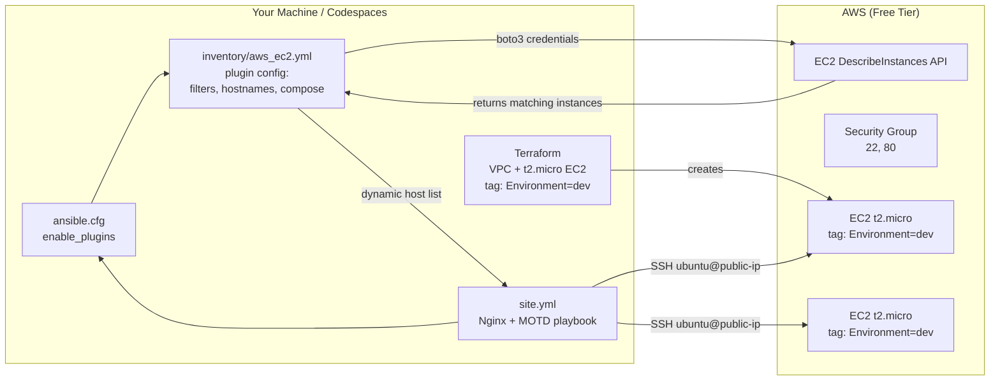

# Lab 14 — Dynamic Inventory with the `amazon.aws.aws_ec2` Plugin

So far, every Ansible run needed a **static inventory file** that listed your hosts by hand (or that Terraform generated for you). That breaks the moment instances come and go. In this lab, Terraform still builds the same free-tier EC2 instance as Lab 05, but Ansible discovers it **on the fly** using the `amazon.aws.aws_ec2` inventory plugin: the plugin calls the AWS API, filters for running instances tagged `Environment = dev`, and builds the host list at runtime. There is **no static inventory file anywhere in this lab**.

## Learning Objectives

- Explain what a dynamic inventory is and why static inventories don't scale.
- Install the `amazon.aws` and `community.aws` collections with `ansible-galaxy`.
- Configure the `amazon.aws.aws_ec2` inventory plugin: regions, filters, `hostnames`, `keyed_groups`, and `compose`.
- Preview an inventory with `ansible-inventory --graph` and inspect host variables with `--list`.
- Tag EC2 instances in Terraform so the plugin can select them with filters.
- Understand inventory caching and the security trade-off of disabling SSH host-key checking.

## Architecture



Add a second instance tagged `Environment=dev` in the AWS console and the next `make deploy` configures it automatically — the playbook never changes.

## Prerequisites

**Tools (exact versions below are what the lab was tested with; nearby versions usually work):**

| Tool | Version | Check with |
|------|---------|------------|
| Terraform | >= 1.6.0 | `terraform version` |
| ansible-core | >= 2.15 | `ansible --version` |
| boto3 (Python) | >= 1.26 | `python3 -m pip show boto3` |
| make | any GNU/BSD make | `make --version` |
| SSH client + key pair | OpenSSH | `ssh -V` |

**Free accounts:**

- An AWS account with a valid **credit/debit card** (required to open an account, but this lab only uses free-tier resources).
- An IAM user with the `AmazonEC2FullAccess` managed policy (or equivalent) for Terraform, plus the same credentials usable by boto3 for the inventory plugin.

**Environment variables** (set in your shell before every `make` target):

| Variable | Why |
|----------|-----|
| `AWS_ACCESS_KEY_ID` | Authenticates Terraform *and* the inventory plugin (via boto3). |
| `AWS_SECRET_ACCESS_KEY` | Secret half of the above. Never commit it. |
| `AWS_REGION` | Region for both Terraform and the plugin. Falls back to `AWS_DEFAULT_REGION`, then `us-east-1`. |
| `ANSIBLE_SSH_PRIVATE_KEY_FILE` | Optional override for the private key path used by the plugin's `compose` block. Defaults to `~/.ssh/devops-labs.pem`. |

Generate an SSH key pair first (Terraform uploads the public half to AWS):

```bash
ssh-keygen -t ed25519 -f ~/.ssh/devops-labs -N ""
# The private key is ~/.ssh/devops-labs (no .pem). If yours has a .pem suffix,
# set ANSIBLE_SSH_PRIVATE_KEY_FILE accordingly.
```

## Step-by-Step Instructions

### 1. Set credentials

```bash
export AWS_ACCESS_KEY_ID="AKIA..."
export AWS_SECRET_ACCESS_KEY="wJalrXUtnFEMI..."
export AWS_REGION="us-east-1"
export ANSIBLE_HOST_KEY_CHECKING=False   # see the security note below
```

> **Security caveat for `ANSIBLE_HOST_KEY_CHECKING=False`:** this disables SSH's protection against man-in-the-middle attacks — anyone able to intercept your connection could impersonate the server. Acceptable for short-lived throwaway lab instances; on untrusted networks, prefer leaving host-key checking ON and answering `yes` when SSH asks, or pre-populate `~/.ssh/known_hosts`. `ansible.cfg` also sets `host_key_checking = False` with a warning comment, so the export above is belt-and-braces, not strictly required.

### 2. Install the Ansible collections

```bash
make setup
# or, manually:
ansible-galaxy collection install -r ansible/requirements.yml
```

Expected output:

```
Starting galaxy collection install process
Process install dependency map
Starting collection install process
Downloading https://galaxy.ansible.com/download/amazon-aws-8.x.x.tar.gz ...
Installing 'amazon.aws:8.x.x' to '/home/you/.ansible/collections/ansible_collections/amazon/aws'
...
```

This also requires `boto3`/`botocore`. If `pip` isn't on your PATH, use your OS package manager or a virtualenv:

```bash
python3 -m pip install boto3
```

### 3. Provision the infrastructure

```bash
cd terraform
terraform init
terraform apply
cd ..
```

Confirm with `yes`. Terraform prints the instance's IP at the end. The instance carries the tags `Name = lab-14-web` and `Environment = dev` (from `var.environment`, default `"dev"`) — that second tag is what the plugin will filter on.

### 4. Preview the dynamic inventory

```bash
make preview
# or: cd ansible && ansible-inventory -i inventory/aws_ec2.yml --graph
```

Expected output (note there is **no static hosts file involved**):

```
@all:
  |--@aws_ec2:
  |  |--54.210.123.45
  |--@env_dev:
  |  |--54.210.123.45
  |--@name_lab_14_web:
  |  |--54.210.123.45
  |--@ungrouped:
```

The `@env_dev` and `@name_lab_14_web` groups were built automatically by the `keyed_groups` from the instance's tags.

To see the host variables the plugin composed (including `ansible_user` and `ansible_ssh_private_key_file`):

```bash
cd ansible && ansible-inventory -i inventory/aws_ec2.yml --list
```

Look for a block like:

```json
"54.210.123.45": {
  "ansible_host": "54.210.123.45",
  "ansible_ssh_private_key_file": "~/.ssh/devops-labs.pem",
  "ansible_user": "ubuntu",
  ...
}
```

### 5. Deploy the playbook

```bash
make deploy
```

Expected output (abridged):

```
PLAY [Configure web servers discovered via the aws_ec2 dynamic inventory] ****

TASK [Install Nginx] ***********************************************************
changed: [54.210.123.45]

TASK [Ensure Nginx is started and enabled] *************************************
ok: [54.210.123.45]

TASK [Deploy a custom index page] **********************************************
changed: [54.210.123.45]

RUNNING HANDLER [Reload nginx] *************************************************
changed: [54.210.123.45]

PLAY RECAP *********************************************************************
54.210.123.45              : ok=5    changed=3    unreachable=0    failed=0
```

### 6. (Optional) Prove it's really dynamic

In the AWS console, **launch a second `t2.micro`** with the same tags (`Environment = dev`, any `Name`). Wait for it to reach `running` state, then run `make preview` again — it appears instantly, no file edits. Run `make deploy` and Ansible configures both. Terminate it when done.

### About inventory caching

Every Ansible run calls the EC2 `DescribeInstances` API. On large accounts that's slow and can hit rate limits, so the plugin supports **caching** its API response:

1. Uncomment the `cache:`, `cache_plugin:`, `cache_connection:`, `cache_timeout:` lines at the bottom of `ansible/inventory/aws_ec2.yml`.
2. Configure the cache backend in `ansible/ansible.cfg` under `[defaults]`:

   ```ini
   fact_caching = ansible.builtin.jsonfile
   fact_caching_connection = /tmp/ansible_inventory_cache
   fact_caching_timeout = 300
   ```

3. Re-run `make preview` — the first run queries AWS and writes the cache; subsequent runs (within the timeout) read the local cache.

**Gotcha:** with caching on, a brand-new instance may *not* appear until the cache expires or you flush it with `ansible-inventory -i inventory/aws_ec2.yml --flush-cache`. Leave caching off while learning; enable it when runs get slow.

## How Do I Know This Worked?

```bash
# 1. The inventory is non-empty and grouped by tags
make preview                          # you should see @env_dev with your instance IP

# 2. Ansible can actually reach the hosts over SSH
make ping                             # expect "pong" per host

# 3. The playbook runs green
make deploy                           # failed=0, unreachable=0

# 4. Nginx serves the lab page (use the IP from make preview or terraform output)
curl http://$(cd terraform && terraform output -raw instance_public_ip)
```

Success looks like the HTML page containing "Served by 54.210.123.45" and "discovered automatically by the amazon.aws.aws_ec2 inventory plugin". SSH in to see the MOTD:

```bash
ssh -i ~/.ssh/devops-labs ubuntu@<PUBLIC_IP>
# banner: "This machine is managed by Ansible (Lab 14 - Dynamic Inventory)."
```

## Cleanup

```bash
make destroy        # terraform destroy — deletes the EC2 instance, VPC, SG, key pair
```

Then confirm **zero running instances** in the AWS EC2 console (Regions dropdown → check the region you used) and review **Billing → Bills** for the month. `make clean` removes only local artifacts (`.terraform/`, caches, retry files) — it never touches cloud resources.

## Troubleshooting

**1. `ansible-inventory` says `No inventory was parsed, only implicit localhost is available`, or the graph is empty.**

- *Symptom:* `make preview` shows just `@all:` and `@ungrouped:` with no hosts.
- *Cause:* Either the plugin isn't enabled, the region is wrong, or no instance matches the filters. The plugin is silently ignored if `enable_plugins` in `ansible.cfg` doesn't include `amazon.aws.aws_ec2`, and boto3 defaults to a different region than Terraform if `AWS_REGION` isn't exported.
- *Fix:* Confirm `[inventory] enable_plugins = amazon.aws.aws_ec2, ...` in `ansible/ansible.cfg`. Confirm `echo $AWS_REGION` matches the region Terraform used (`cd terraform && terraform output` works only if the instance exists). Check the instance's tags in the EC2 console — it must be `running` and tagged exactly `Environment: dev`. Run the plugin verbosely to see the API calls: `ansible-inventory -i inventory/aws_ec2.yml --list -vvv`.

**2. `The amazon.aws.aws_ec2 inventory plugin requires boto3 and botocore`.**

- *Symptom:* inventory commands fail with an import error mentioning `botocore`.
- *Cause:* The Python interpreter that runs Ansible doesn't have `boto3` installed (common when Ansible runs from a system package but `pip` installed boto3 into a user site or virtualenv).
- *Fix:* Install it into the same Python Ansible uses: `python3 -m pip install boto3` then `python3 -c "import botocore; print(botocore.__version__)"` to verify. If you use a virtualenv for Ansible, activate it first.

**3. `UNREACHABLE! ... Permission denied (publickey)` or SSH connection timeouts.**

- *Symptom:* `make ping` or `make deploy` fails on every host with `Permission denied (publickey,...)`, or hangs on `ESTABLISH SSH CONNECTION`.
- *Cause:* The private key path in the inventory's `compose` block doesn't match your machine, or the security group doesn't allow SSH from your IP. If you regenerated a key after `terraform apply`, the public key in AWS no longer matches your private key.
- *Fix:* Point the plugin at the right key: `export ANSIBLE_SSH_PRIVATE_KEY_FILE=~/.ssh/your-key` and re-run. Check the security group allows TCP 22 from your address (`var.allowed_ssh_cidr` in `terraform/variables.tf`). If you changed keys, run `terraform apply` again to update the AWS key pair, or `make destroy && make deploy` after fixing `public_key_path`.

## Free Tier Notes

- This lab creates one `t2.micro` instance (750 hours/month free for 12 months from account creation), a VPC/subnet/IGW/route table (free), one security group (free), and one key pair (free). The `ubuntu` AMI and an 8 GiB root EBS volume fall within the 30 GiB-month free EBS allowance.
- **Free tiers change.** AWS can modify or retire free-tier offerings at any time. Always:
  1. Run `make destroy` when you are done — a forgotten running `t2.micro` costs ~$8/month once free hours run out.
  2. Check **AWS Console → Billing → Bills** after the lab.
  3. Delete the AMI snapshots/EBS volumes if any remain after destroy (EC2 console → Elastic Block Store → Volumes/Snapshots).
- The inventory plugin itself only makes free `Describe*` API calls.
