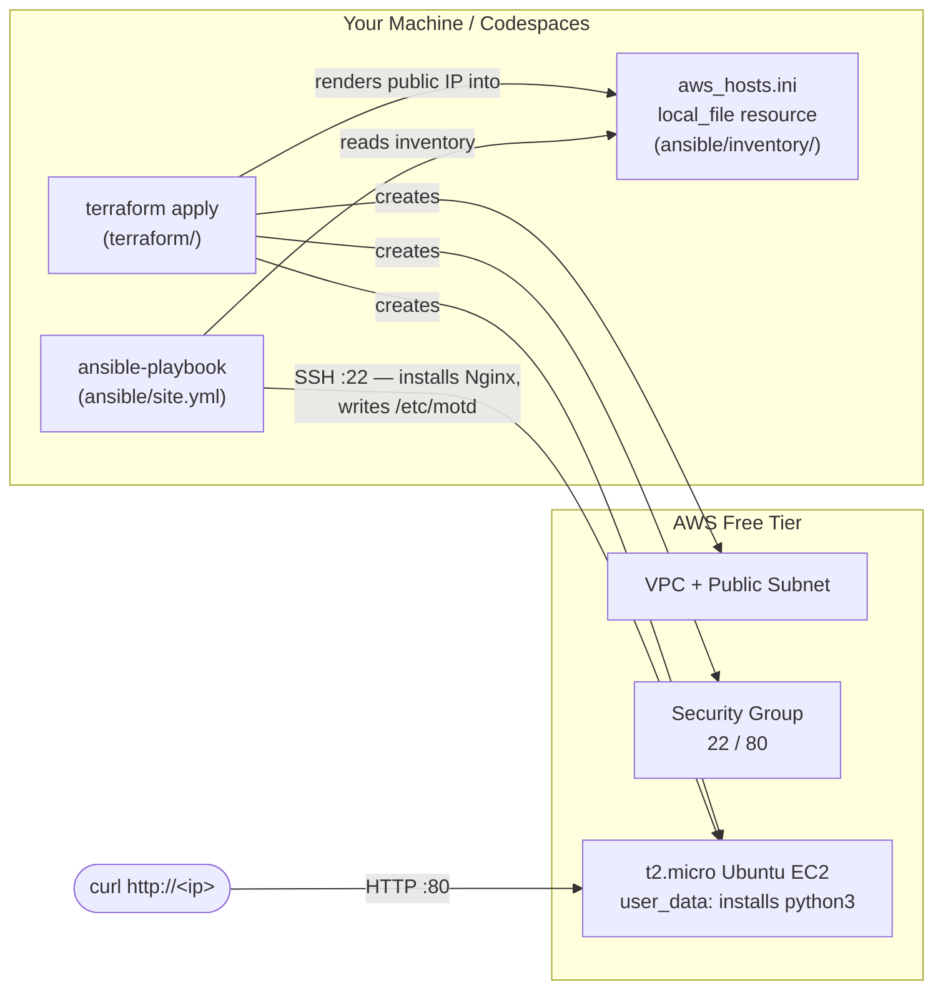

# Lab 13 — Terraform → Ansible Integration

So far you've used Terraform to **build** infrastructure and Ansible to **configure** machines — but you've always copied IP addresses between the two by hand. In this lab you close that gap: Terraform creates a free-tier AWS web stack and then *writes the Ansible inventory file itself* via a `local_file` resource, so Ansible always knows exactly which host to configure. This static-inventory handoff is the simplest of several integration patterns (Lab 14 replaces it with a dynamic inventory plugin).

## Learning Objectives

- Explain the division of labor: **Terraform provisions, Ansible configures**.
- Use the `hashicorp/local` provider and its `local_file` resource to render a file from Terraform values.
- Generate a ready-to-use Ansible inventory (`[webservers]` group, `ansible_user`, SSH hints) from Terraform outputs — no manual IP copying.
- Write an OS-family-agnostic playbook with `ansible.builtin.apt` / `ansible.builtin.yum` and `when: ansible_facts['os_family'] == ...` conditionals.
- Deploy a custom MOTD with `ansible.builtin.copy` and verify configuration over both HTTP and SSH.
- Chain the two tools in one `make all` run with a guard that fails cleanly when the inventory is missing.

## Architecture



## Prerequisites

**Tools (exact versions):**

| Tool | Version | Check with |
|------|---------|------------|
| Terraform | >= 1.5.0 | `terraform version` |
| AWS provider | ~> 5.0 (installed automatically by `terraform init`) | — |
| local provider | ~> 2.5 (installed automatically by `terraform init`) | — |
| Ansible core | >= 2.14 | `ansible --version` |
| AWS CLI | >= 2.x (only needed to create the key pair) | `aws --version` |
| make | any (Git Bash / GNU Make) | `make --version` |
| curl | any | `curl --version` |

**Free accounts:**

- An AWS account (free tier). You will stay within the 12-month-free-tier `t2.micro` allowance (750 hours/month).
- An IAM user with `AmazonEC2FullAccess` (or equivalent) **or** the keys from your admin user — used only locally, never committed. (CI-based AWS auth with OIDC is covered in Lab 08 and Lab 17.)

**Required environment variables** (Terraform reads them automatically — never put them in code):

```bash
export AWS_ACCESS_KEY_ID="AKIA..."        # your IAM user's access key ID
export AWS_SECRET_ACCESS_KEY="wJalr..."   # the matching secret access key
export AWS_DEFAULT_REGION="us-east-1"     # optional; the lab defaults to us-east-1
```

If you prefer a shared credentials file, `~/.aws/credentials` works too — Terraform picks it up with no exports.

**AWS key pair (one-time setup):** the instance needs an EC2 key pair for SSH. Either create it in the console (*EC2 → Network & Security → Key Pairs → Create key pair*, name it `lab13-key`, download the `.pem`), or:

```bash
aws ec2 create-key-pair --key-name lab13-key \
  --query 'KeyMaterial' --output text > ~/.ssh/lab13-key.pem
chmod 600 ~/.ssh/lab13-key.pem
```

> The lab's example commands use `~/.ssh/id_rsa` as the private key (per the task flow). If your key is `~/.ssh/lab13-key.pem`, just replace the path — or use `make all KEY=~/.ssh/lab13-key.pem`. The private key **never** appears in Terraform or the inventory (the inventory only contains a commented-out hint).

## Step-by-Step Instructions

1. **Clone/check out this branch and enter the lab directory** (the files listed below live at the repo root of the `lab-13-tf-ansible-integration` branch):

   ```bash
   git checkout lab-13-tf-ansible-integration
   ```

2. **Configure your variables.** Copy the example and set your AWS key pair name:

   ```bash
   cp terraform/terraform.tfvars.example terraform/terraform.tfvars
   # edit terraform.tfvars: set key_name = "lab13-key" (the pair you created above)
   ```

3. **Export your AWS credentials** (see Prerequisites) and verify:

   ```bash
   echo "Key id starts with: ${AWS_ACCESS_KEY_ID:0:4}"   # should print AKIA (or ASIA)
   ```

4. **Provision the infrastructure.** Terraform creates the VPC, subnet, security group, EC2 instance — and then writes the Ansible inventory:

   ```bash
   cd terraform
   terraform init
   terraform apply
   ```

   Type `yes` when prompted. Expected tail of the output:

   ```
   Apply complete! Resources: 8 added, 0 changed, 0 destroyed.

   Outputs:

   curl_check_command = "curl http://54.210.123.45"
   inventory_file = "../ansible/inventory/aws_hosts.ini"
   ssh_motd_command = "ssh -i ~/.ssh/id_rsa ubuntu@54.210.123.45"
   web_public_ip = "54.210.123.45"
   ```

5. **Confirm the inventory was generated** — this is the handoff artifact:

   ```bash
   cd ..
   cat ansible/inventory/aws_hosts.ini
   ```

   Expected content (with your real IP):

   ```ini
   # GENERATED BY TERRAFORM — do not edit by hand.
   ...
   [webservers]
   54.210.123.45 ansible_user=ubuntu

   [webservers:vars]
   # ansible_ssh_private_key_file = ~/.ssh/id_rsa
   ansible_ssh_common_args = -o StrictHostKeyChecking=accept-new
   ```

6. **(Optional but recommended) Check SSH connectivity first:**

   ```bash
   ansible -i ansible/inventory/aws_hosts.ini webservers \
     -m ansible.builtin.ping -u ubuntu --private-key ~/.ssh/id_rsa
   # Expected: "54.210.123.45 | SUCCESS => { \"ping\": \"pong\" }"
   ```

7. **Configure the host with Ansible** — installs Nginx and writes the custom MOTD:

   ```bash
   ansible-playbook -i ansible/inventory/aws_hosts.ini ansible/site.yml \
     -u ubuntu --private-key ~/.ssh/id_rsa
   ```

   Expected tail:

   ```
   TASK [Deploy a custom MOTD] ****************************************************
   changed: [54.210.123.45]

   PLAY RECAP *********************************************************************
   54.210.123.45              : ok=4    changed=3    unreachable=0    failed=0    skipped=0
   ```

   Run the same command a second time and notice `changed=0` — the playbook is idempotent.

8. **Or do steps 4–7 in one shot** with the lab's `all` target (it applies Terraform, then refuses to run Ansible unless the inventory file exists):

   ```bash
   make all            # add KEY=~/.ssh/lab13-key.pem if your key isn't id_rsa
   ```

## How Do I Know This Worked?

1. **HTTP check** — Nginx serves the default welcome page:

   ```bash
   curl http://$(cd terraform && terraform output -raw web_public_ip)
   ```

   Success = HTML containing `<title>Welcome to nginx!</title>`.

2. **SSH MOTD check** — the MOTD Ansible deployed is printed right after login:

   ```bash
   ssh -i ~/.ssh/id_rsa ubuntu@$(cd terraform && terraform output -raw web_public_ip)
   ```

   Success = a banner reading **"Managed by Ansible - created by Terraform (Lab 13)"** appears before the shell prompt; `exit` returns you to your machine.

3. **Idempotence check** — re-running the playbook changes nothing:

   ```bash
   ansible-playbook -i ansible/inventory/aws_hosts.ini ansible/site.yml \
     -u ubuntu --private-key ~/.ssh/id_rsa | tail -n 3
   ```

   Success = `changed=0` in the `PLAY RECAP` line.

## Cleanup

```bash
cd terraform
terraform destroy          # type "yes"; removes the EC2, SG, subnet, VPC, IGW...
```

Two notes about the inventory file:

- Because `aws_hosts.ini` is a **Terraform-managed resource**, `terraform destroy` also deletes it — nothing stale is left behind.
- On every future `terraform apply` the file is **recreated from scratch** with the current public IP, so if you re-provision later, always use the freshly generated inventory rather than an old copy.

Optional tidy-up: delete the key pair in the EC2 console if you don't need it, then check the AWS Billing console (see Free Tier Notes).

## Troubleshooting

1. **`ansible-playbook` fails with `UNREACHABLE! ... Permission denied (publickey)`**
   - **Symptom:** the ping or playbook step cannot authenticate; the host is reachable but SSH rejects the key.
   - **Cause:** the `--private-key` file doesn't match the AWS key pair named in `key_name` (or its permissions are too open, e.g. a `.pem` left at `0644`).
   - **Fix:** verify `terraform.tfvars` has the right `key_name`, point `--private-key` at the matching private key, and run `chmod 600` on it. Retest with `make ping`.

2. **`ERROR: ansible/inventory/aws_hosts.ini not found` (from `make all`)**
   - **Symptom:** the `all` target stops after (or before) the playbook with the guard message.
   - **Cause:** `terraform apply` didn't finish successfully, or you ran the playbook from a different working directory where the relative path doesn't resolve.
   - **Fix:** re-run `terraform -chdir=terraform apply` and check for errors; confirm the file exists with `cat ansible/inventory/aws_hosts.ini`; always run `make` from the lab root directory.

3. **`UNREACHABLE! ... Failed to connect to the host via ssh: Connection timed out`**
   - **Symptom:** SSH hangs for ~a minute then times out.
   - **Cause:** either the instance hasn't finished booting and running `user_data` (which installs `python3`), or the security group doesn't allow your IP on port 22 (check `ssh_allowed_cidr` in `terraform.tfvars` if you restricted it), or you just ran `terraform destroy` and the inventory holds a dead IP.
   - **Fix:** wait 1–2 minutes after apply and retry; run `aws ec2 describe-security-groups` to confirm an ingress rule on port 22 covering your IP; if you destroyed/re-applied, regenerate the inventory with `terraform -chdir=terraform apply` (it is recreated every apply).

## Free Tier Notes

- This lab creates exactly **one `t2.micro`** EC2 instance, a VPC, a subnet, an internet gateway, a route table, and a security group. The `t2.micro` is covered by the AWS 12-month free tier (750 hours/month — running **one** instance 24/7 fits), and VPC/subnet/IGW/route table/security group are **free** (only data transfer and public IPv4 charges may apply; the tiny traffic from `curl` is negligible).
- **Free tiers change.** AWS can and does revise free-tier terms — always (1) run `terraform destroy` when done, (2) check the **Billing** dashboard (and set a billing alarm / free-tier alert in the console) after the lab.
- If your 12-month free tier has already expired, an hour of `t2.micro` costs roughly a cent — still trivial, but destroy promptly and verify in Billing.
- Nothing in this lab uses Terraform Cloud or other paid services; state stays local.
