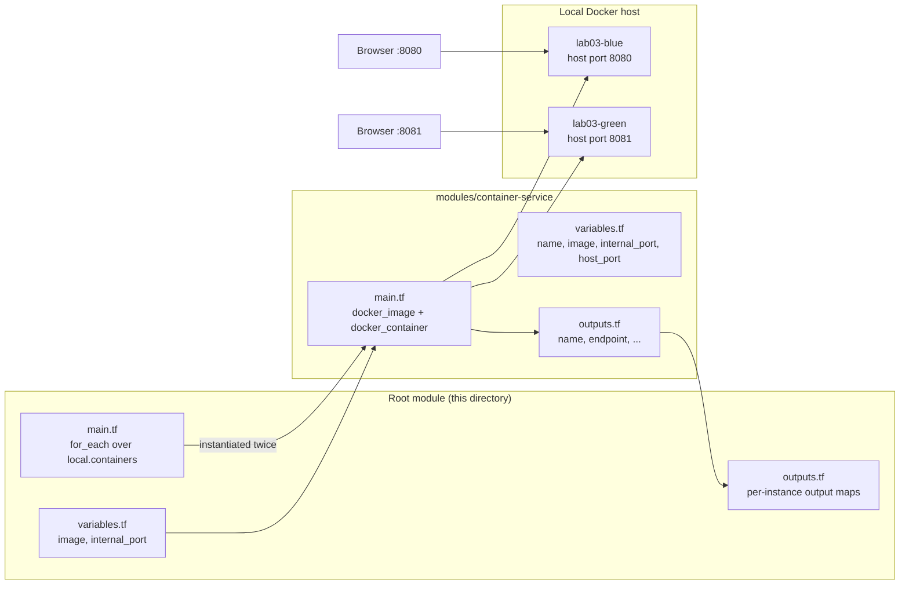

# Lab 03 — Modules

Lab 02 ended with a root module full of variables, locals, and outputs. That
works, but copy-pasting resource blocks every time you want a second container
does not scale. In this lab you refactor that code into a **reusable local
module** called `container-service` and call it **twice** — a **blue** and a
**green** Nginx container — with a single `for_each` over a map. Along the way
you learn how module inputs/outputs work and how to read the output of one
specific module instance (e.g. `module.container_service["blue"].name`).

Everything runs against a **local Docker daemon**, so there are **no cloud
costs** and nothing to sign up for beyond a GitHub account.

## Learning Objectives

- Explain what a Terraform module is and why you would extract one.
- Move resources into `modules/<name>/` and wire them up with input variables and outputs.
- Call a module multiple times with `for_each` over a map.
- Access per-instance module outputs with the `module.<name>["<key>"].<output>` syntax.
- Read module output maps with `for` expressions in root outputs.
- Verify `terraform fmt`, `terraform validate`, and `terraform plan` in GitHub Actions CI.

## Architecture



## Prerequisites

Exact tools and versions (run `make setup` to check your machine):

| Tool       | Version           | Purpose                              |
|------------|-------------------|--------------------------------------|
| Git        | any recent        | Clone/checkout the lab branch        |
| Terraform  | >= 1.5.0          | Provisions the containers            |
| Docker     | >= 20.10          | Runs the containers                  |
| GNU Make   | any recent        | Convenience targets                  |
| curl       | any recent        | Verifying the containers respond     |

Free accounts needed: **none** — this lab is 100% local. (Later labs use AWS
and Terraform Cloud free tiers; each of those READMEs says exactly what to
create.)

Required environment variables: **none**. No credentials are used anywhere in
this lab — the Docker provider talks to your local Docker daemon socket.

## Step-by-Step Instructions

1. **Check out the lab branch** (or open this repo in GitHub Codespaces and
   select the branch):

   ```bash
   git checkout lab-03-modules
   ```

2. **Verify prerequisites**:

   ```bash
   make setup
   ```

   Expected output (versions vary):

   ```
   Terraform v1.9.x
   Docker version 24.x.x ...
   GNU Make 4.x
   ```

3. **Look at the module first.** Open `modules/container-service/`. Notice it
   is a mini root module: it has its own `main.tf`, `variables.tf`, and
   `outputs.tf`, and it knows nothing about "blue" or "green" — it just builds
   *one* container from whatever image/ports you pass in.

4. **Read the root `main.tf`.** The interesting part is:

   ```hcl
   locals {
     containers = {
       blue  = { host_port = 8080 },
       green = { host_port = 8081 }
     }
   }

   module "container_service" {
     source   = "./modules/container-service"
     for_each = local.containers

     name          = "lab03-${each.key}"
     image         = var.image
     internal_port = var.internal_port
     host_port     = each.value.host_port
   }
   ```

   Terraform instantiates the module once per map entry. Inside the module,
   `each.key` is `"blue"` or `"green"` and `each.value` is the object
   containing that instance's `host_port`.

5. **Format and lint**:

   ```bash
   make lint
   ```

   Expected output:

   ```
   terraform fmt -check -recursive
   # (no output = everything already formatted)
   ```

6. **Initialize and validate** (this downloads the Docker provider):

   ```bash
   make test
   ```

   Expected output (tail):

   ```
   Initializing modules...
   ...
   Terraform has been successfully initialized!
   ...
   Success! The configuration is valid.
   ```

7. **Preview the plan**:

   ```bash
   terraform plan
   ```

   Expected output (abridged) — note the `module.container_service["blue"]`
   and `module.container_service["green"]` addresses:

   ```
   Terraform will perform the following actions:
     # module.container_service["blue"].docker_container.this will be created
     # module.container_service["blue"].docker_image.this will be created
     # module.container_service["green"].docker_container.this will be created
     # module.container_service["green"].docker_image.this will be created
   Plan: 4 to add, 0 to change, 0 to destroy.
   ```

8. **Deploy**:

   ```bash
   make deploy
   ```

   Type `yes` when prompted. Expected output ends with something like:

   ```
   Apply complete! Resources: 4 added, 0 changed, 0 destroyed.

   Outputs:

   blue_container_name = "lab03-blue"
   container_names = {
     "blue" = "lab03-blue"
     "green" = "lab03-green"
   }
   endpoints = {
     "blue" = "http://localhost:8080"
     "green" = "http://localhost:8081"
   }
   ```

9. **See how per-instance outputs work**. Run:

   ```bash
   terraform output blue_container_name
   ```

   Expected output: `"lab03-blue"` — this value came from
   `module.container_service["blue"].name`, demonstrating the instance-access
   syntax.

## How Do I Know This Worked?

1. **Both containers exist and are running**:

   ```bash
   docker ps --filter "name=lab03-" --format "table {{.Names}}\t{{.Ports}}"
   ```

   Expected output (image column trimmed for readability):

   ```
   NAMES        PORTS
   lab03-blue   0.0.0.0:8080->80/tcp, ...
   lab03-green  0.0.0.0:8081->80/tcp, ...
   ```

2. **Both endpoints serve Nginx**:

   ```bash
   curl -s -o /dev/null -w "%{http_code}\n" http://localhost:8080
   curl -s -o /dev/null -w "%{http_code}\n" http://localhost:8081
   ```

   Each command should print `200`.

3. **Outputs match the two instances**:

   ```bash
   terraform output endpoints
   ```

   Expected output:

   ```
   endpoints = {
     "blue" = "http://localhost:8080"
     "green" = "http://localhost:8081"
   }
   ```

## Cleanup

Tear everything down (removes both containers and the downloaded images):

```bash
make destroy
```

Type `yes` when prompted. Expected final line:

```
Destroy complete! Resources: 4 destroyed.
```

Confirm nothing is left:

```bash
docker ps -a --filter "name=lab03-"
```

Expected output: an empty table (just the header row). Then optionally run
`make clean` to remove the `.terraform/` directory and the local state files.

## Troubleshooting

**1. Error: `Error response from daemon: ... port is already allocated`**

- **Symptom:** `terraform apply` fails when creating a container, mentioning
  port `8080` or `8081`.
- **Cause:** Something else on your machine is already bound to that host port
  (a leftover container, a local dev server, or a previous lab).
- **Fix:** Find the culprit with `docker ps` (or `netstat -ano | findstr 8080`
  on Windows) and either stop it or change the `host_port` value in the
  `local.containers` map in `main.tf`, then run `make deploy` again.

**2. Error: `Invalid index: the given key does not identify an element in this collection`**

- **Symptom:** `terraform plan` or `terraform output` fails with an error
  pointing at `module.container_service["blue"]`.
- **Cause:** You renamed a key in the `local.containers` map (e.g. `"blue"`
  to `"primary"`) but an output or reference still uses the old key.
- **Fix:** Search for the old key (`grep -r '"blue"' .` on Linux/macOS or
  `findstr /s /c:"blue" *.tf` on Windows) and update the reference, or rename
  the key back. With `for_each`, keys must match exactly.

**3. Error: `Error: Inconsistent dependency lock file` or `Module not installed`**

- **Symptom:** Commands fail claiming modules/providers are missing after you
  cloned the repo or switched branches.
- **Cause:** `terraform init` has not been run in this working directory, or
  it was run before `modules/container-service` existed.
- **Fix:** Run `terraform init` (or simply `make test`, which runs
  `init -upgrade` followed by `validate`). Never commit `.terraform/` — it is
  gitignored and rebuilt by init.

## Free Tier Notes

This lab creates **only local Docker resources** — there are no cloud
resources, no AWS costs, and no Terraform Cloud usage. Still, keep the general
habits from the other labs: free tiers (AWS, Terraform Cloud, GitHub) change
over time, so always run `make destroy` when you finish a lab and check the
billing console of any cloud account you use elsewhere in this repository.
