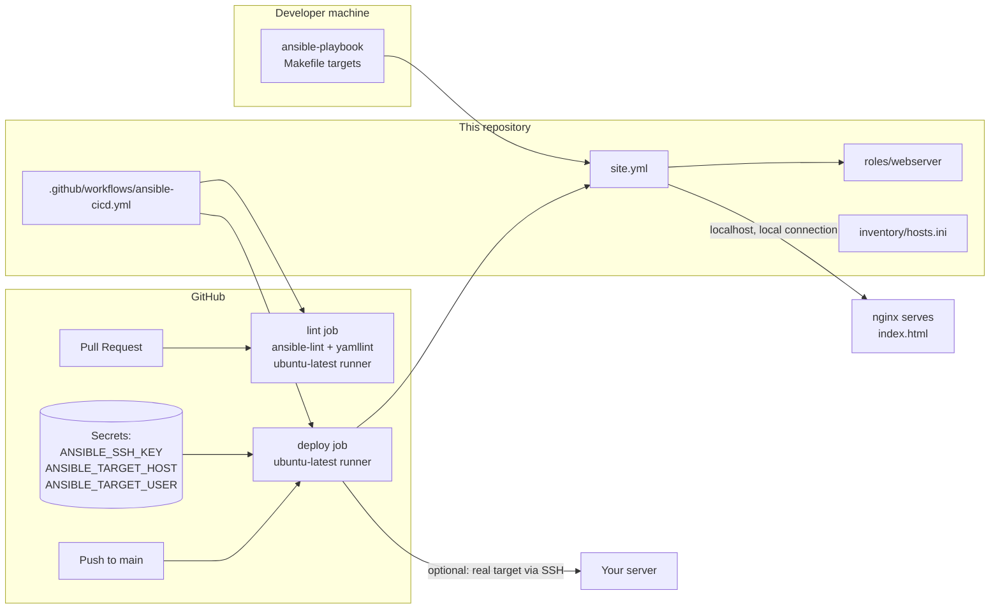

# Lab 16 — Ansible CI/CD with GitHub Actions

This lab takes the reusable `webserver` Ansible role from Lab 11 and wraps it
in a real CI/CD pipeline: every pull request is gated by `ansible-lint` and
`yamllint`, and every push to `main` automatically runs `ansible-playbook`
against the inventory. The deploy target is `localhost` on the free
`ubuntu-latest` GitHub Actions runner, so you get an end-to-end deployment
pipeline without paying for a single server — and the workflow includes an
optional, documented path for pointing it at a real machine with GitHub
Secrets.

## Learning Objectives

- Structure a reusable Ansible role (`tasks/`, `handlers/`, `defaults/`,
  `vars/`, `files/`, `templates/`).
- Write a GitHub Actions workflow with two event-driven jobs: lint on
  `pull_request`, deploy on `push` to `main`.
- Run `ansible-playbook` in CI against `localhost` via a local connection.
- Understand SSH host key checking and why CI disables it (`ANSIBLE_HOST_KEY_CHECKING=False`) — and how to do it properly for real targets with `known_hosts` / `ssh-keyscan`.
- Parameterize a workflow for a real target using GitHub Secrets
  (`ANSIBLE_SSH_KEY`, `ANSIBLE_TARGET_HOST`, `ANSIBLE_TARGET_USER`).

## Architecture



## Prerequisites

- **Git** (2.40+) and a free **GitHub** account with a repository you can push to.
- **Python** 3.10+ (for local runs; CI installs its own via `actions/setup-python@v5`).
- **Ansible** 9.x+ (`pip install ansible`) — only needed for local runs and linting.
- **ansible-lint** 24.x+ and **yamllint** 1.35+ (`pip install ansible-lint yamllint`).
- **Make** (Git Bash / WSL on Windows; preinstalled on Linux and macOS).
- Local deploy verification needs an Ubuntu/Debian machine (or WSL) since the
  role uses `ansible.builtin.apt`.
- Environment variables: none are required. Optional CI secrets are listed in
  "Pointing the workflow at a real target" below.

## Step-by-Step Instructions

1. **Copy the lab files into your repository** (or clone this repo and `cd`
   into the lab directory). The layout is:

   ```text
   site.yml                 # playbook: applies the webserver role to [web]
   ansible.cfg              # inventory/roles path, output, host key defaults
   inventory/hosts.ini      # [web] group -> localhost (local connection)
   roles/webserver/         # the Lab 11 role
   .github/workflows/ansible-cicd.yml
   Makefile
   ```

2. **Verify your local tooling** (matches what CI will run):

   ```bash
   make setup
   ```

   Expected output ends with `All tools found.` and an Ansible version line.

3. **Lint everything locally** — this is the exact check the PR job runs:

   ```bash
   make lint
   ```

   Expected output:

   ```text
   Running ansible-lint...
   Running yamllint...
   Lint passed.
   ```

   (`ansible-lint` prints `Passed: 0 failure(s), 0 warning(s)` when clean.)

4. **Syntax-check and ping the inventory** (no changes made):

   ```bash
   make test
   make ping
   ```

   Expected output: `Syntax check passed.`, then a green
   `"ping": "pong"` from `localhost`.

5. **Deploy locally** (installs nginx on your machine — Ubuntu/Debian/WSL only):

   ```bash
   make deploy
   ```

   Expected output ends with a play recap similar to:

   ```text
   PLAY RECAP ****************************************************************
   localhost                  : ok=6    changed=3    unreachable=0    failed=0    skipped=0    rescued=0    ignored=0
   ```

   Then verify nginx responds:

   ```bash
   curl -s http://localhost/health-check.txt   # -> ok
   curl -s http://localhost/ | head -n 5       # -> your templated index.html
   ```

6. **Push the workflow to GitHub** and watch CI run:

   ```bash
   git checkout -b ci-demo
   git add .
   git commit -m "Add Ansible CI/CD workflow"
   git push -u origin ci-demo
   ```

   Open a pull request against `main`. The **Lint Ansible and YAML** job runs
   `ansible-lint` and `yamllint`. Merge the PR — the **Deploy web server** job
   runs on the push to `main` and installs nginx on the runner.

7. **Confirm the deploy job succeeded** in the Actions tab: the *Run playbook
   against localhost* step should end with `failed=0`.

### Pointing the workflow at a real target

By default the deploy job targets `localhost` (local connection, no SSH). To
deploy to a real server instead, add these **repository secrets** (Settings →
Secrets and variables → Actions → New repository secret):

| Secret | Required | Purpose |
|---|---|---|
| `ANSIBLE_SSH_KEY` | yes (for real targets) | Private SSH key allowed to log in to the target. Stored as a secret; never printed in logs. |
| `ANSIBLE_TARGET_HOST` | yes (for real targets) | IP or DNS name of the target. When set, the *real target* deploy step runs instead of the localhost one. |
| `ANSIBLE_TARGET_USER` | no | SSH user on the target; defaults to `ubuntu` in the workflow. |

The *Install SSH key* step writes the key to `~/.ssh/id_ed25519`, and the
*Run playbook against real target* step overrides the inventory host variables:

```bash
ansible-playbook -i inventory/hosts.ini site.yml \
  -e "ansible_host=$ANSIBLE_TARGET_HOST ansible_user=${ANSIBLE_TARGET_USER:-ubuntu} ansible_connection=ssh"
```

## Host key checking in CI

When Ansible connects over SSH for the first time, OpenSSH asks you to
confirm the server's host key ("The authenticity of host ... can't be
established"). In an interactive terminal you answer `yes` and the key is
recorded in `~/.ssh/known_hosts`; on a CI runner there is no one to answer the
prompt, so the connection would hang and fail.

The workflow sets `ANSIBLE_HOST_KEY_CHECKING=False`, which turns that prompt
off.

**Security trade-off, spelled out:** with host key checking disabled, Ansible
cannot detect a man-in-the-middle attack — an attacker who intercepts your
connection to the target can present their own key and Ansible will connect
and happily send your commands (and any secrets used by the playbook) to
them. Disabling the check trades that protection for automation.

That is acceptable **in this CI job only** because the default target is
`localhost` over a *local* connection — SSH is not even used. It is **not**
acceptable as a default when deploying to real machines over untrusted
networks.

**The proper way for real targets** is to pre-populate `known_hosts` instead
of disabling the check. Two common options:

1. **`ssh-keyscan` at deploy time** — record the target's current key before
   the playbook runs:

   ```yaml
   - name: Record target host key
     run: |
       mkdir -p ~/.ssh
       ssh-keyscan -H "$ANSIBLE_TARGET_HOST" >> ~/.ssh/known_hosts
   ```

   Better than disabling the check, but it still trusts whatever key the
   network returns on that first scan.

2. **Pin the expected key** (strongest) — store the target's public host key
   (from `ssh-keygen -lf /etc/ssh/ssh_host_ed25519_key.pub` on the target, or
   `ssh-keyscan <host>` run from a trusted network) as a secret, then write it
   into `~/.ssh/known_hosts` before connecting. Ansible then refuses to
   connect unless the server presents exactly that key.

## How Do I Know This Worked?

- Locally: `make lint` and `make test` pass with no failures.
- Locally after `make deploy`: `curl -s http://localhost/health-check.txt`
  prints `ok`, and `curl -s http://localhost/` shows the title
  "Hello from the Ansible CI/CD lab".
- In GitHub: on a PR, the *Lint Ansible and YAML* job is green. After merging
  to `main`, the *Deploy web server* job is green and its *Run playbook
  against localhost* step ends with `failed=0` in the play recap.
- With a real target configured: `curl -s http://<target>/health-check.txt`
  prints `ok` from your server after the push-to-main job finishes.

## Cleanup

- **Local machine (Ubuntu/Debian/WSL):** run `make destroy` for the exact
  commands, or execute them directly:

  ```bash
  sudo apt-get remove --purge -y nginx nginx-common
  sudo rm -f /var/www/html/index.html /var/www/html/health-check.txt
  ```

- **CI runners:** nothing to clean up — `ubuntu-latest` runners are ephemeral
  and discarded after each job.
- **Real target:** run the two commands above on that machine.
- **Repository secrets:** delete them under Settings → Secrets and variables →
  Actions if you no longer need them.
- **Local junk:** `make clean` removes `.retry` files and Python caches only.

## Troubleshooting

1. **Symptom:** `ansible-lint` fails in CI with
   `"name" is not allowed` or `yaml[line-length]` errors.
   **Cause:** tasks or plays without a `name`, lines over 80 characters, or
   truthy `yes`/`no` instead of `true`/`false` — the lint rules this repo
   enforces.
   **Fix:** run `make lint` locally; it reports the same violations with file
   and line numbers. Add names, wrap long lines, and use `true`/`false`.

2. **Symptom:** the deploy job fails with
   `Failed to connect to the host via ssh: Host key verification failed.`
   **Cause:** the target is a real host, `ANSIBLE_SSH_KEY` is set, but
   `ANSIBLE_HOST_KEY_CHECKING=False` was removed or the runner's
   `known_hosts` does not contain the target.
   **Fix:** either restore the `ANSIBLE_HOST_KEY_CHECKING: "False"` env (CI
   convenience, see the host key section for the trade-off) or — better —
   add an `ssh-keyscan`/pinned-key step that populates `~/.ssh/known_hosts`
   before the playbook runs.

3. **Symptom:** `make deploy` locally fails with
   `Permission denied` when writing to `/var/www/html`, or the nginx service
   fails to start.
   **Cause:** the playbook uses `become: true`, so your local user needs
   passwordless sudo, or you are running on a non-Debian system where
   `apt`/the `nginx` service does not exist.
   **Fix:** ensure `sudo -n true` succeeds for your user (add a sudoers rule),
   and run on Ubuntu/Debian/WSL. For other distributions override
   `nginx_package_name`/`nginx_service_name` (`httpd` on RHEL-family).

## Free Tier Notes

This lab creates **no cloud resources at all**: the CI lint and deploy jobs
run on the free `ubuntu-latest` GitHub-hosted runners included with every
GitHub account, and the default deploy target is the runner itself. If you
point the workflow at a real target, that machine is yours to pay for (or
keep within your cloud's free tier, e.g. an AWS `t2.micro`/`t3.micro`). Free
tiers and pricing change over time — always run the **Cleanup** steps and
check your cloud provider's billing dashboard after finishing the lab.
