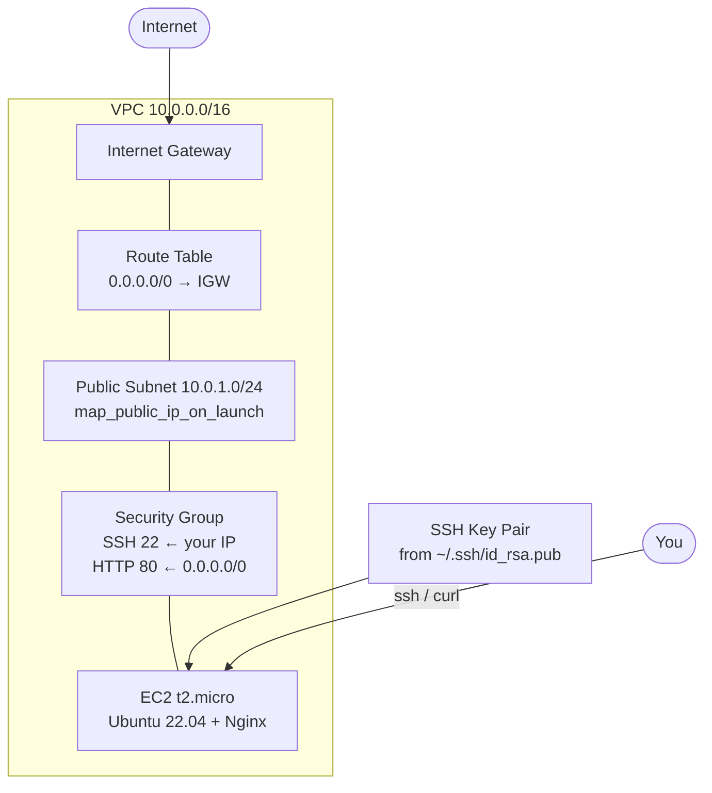

# Lab 05 — AWS Free Tier Infrastructure with Terraform

Build a complete, publicly reachable web server on AWS from scratch using only Free Tier resources: one VPC, one public subnet, one Internet Gateway, one route table, one security group, one SSH key pair, and a single `t2.micro` EC2 instance running Ubuntu 22.04 with Nginx installed automatically. By the end of the lab you will `curl` a live webpage served by a machine Terraform created for you — and you will tear everything down again so it costs nothing.

## Learning Objectives

- Write Terraform code that provisions a full AWS networking stack (VPC → subnet → IGW → route table).
- Look up an official Ubuntu AMI with `data "aws_ami"` instead of hardcoding an AMI ID.
- Restrict security group rules with variables, including scoping SSH to your own IP.
- Provision an EC2 instance with `user_data` cloud-init scripting to install Nginx.
- Manage AWS credentials via environment variables — never hardcode them.
- Read Terraform outputs (public IP, instance ID, SSH command) and verify a deployment end-to-end.
- Destroy every resource and confirm your AWS bill stays at $0.

## Architecture



## Prerequisites

**Tools (exact versions used when writing this lab):**

| Tool | Version | Check with |
| --- | --- | --- |
| Terraform | >= 1.5.0 (tested with 1.9.x) | `terraform version` |
| AWS CLI (optional but recommended) | >= 2.x | `aws --version` |
| Git Bash / WSL / any POSIX shell | any | — |
| `curl` | any | `curl --version` |
| `ssh` (OpenSSH) | any | `ssh -V` |

**Free account:** an AWS account. A credit/debit card is required to open one, but everything in this lab fits in the 12-month Free Tier if you destroy resources afterward.

**SSH key:** you need an existing key pair or generate one (see Troubleshooting if `ssh-keygen` is unfamiliar):

```bash
ssh-keygen -t rsa -b 4096 -f ~/.ssh/id_rsa   # press Enter through the prompts
```

**Required environment variables** — Terraform's AWS provider reads these automatically (it can also use an AWS CLI profile, but env vars are what this lab documents):

| Variable | What it is | Where to get it |
| --- | --- | --- |
| `AWS_ACCESS_KEY_ID` | Access key ID for an IAM user | AWS Console → IAM → Users → your user → Security credentials → Create access key |
| `AWS_SECRET_ACCESS_KEY` | Secret access key (shown once — save it) | Same screen as above |
| `AWS_DEFAULT_REGION` | Optional; the lab defaults to `us-east-1` | — |

> **Security note:** never paste these into any file in this repo. Export them in your shell only. If they leak, deactivate the key in IAM immediately.

```bash
# Linux / macOS / Git Bash
export AWS_ACCESS_KEY_ID="AKIA..."
export AWS_SECRET_ACCESS_KEY="your-secret"
export AWS_DEFAULT_REGION="us-east-1"
```

**IAM permissions:** the user/keys need permission to manage EC2, VPC, and key pairs (the managed policy `AmazonEC2FullAccess` is the simplest option for a lab; in real life use least-privilege).

## Step-by-Step Instructions

**1. Get your public IP** (needed to allow SSH from only your machine):

```bash
curl -s https://checkip.amazonaws.com
# Example output:
# 203.0.113.10
```

**2. Configure the lab variables:**

```bash
make setup          # copies terraform.tfvars.example -> terraform.tfvars
```

Edit `terraform.tfvars` and set `allowed_ssh_cidr` to your IP with `/32`, e.g. `203.0.113.10/32`. Verify your SSH public key exists:

```bash
cat ~/.ssh/id_rsa.pub   # if missing, run: ssh-keygen -t rsa -b 4096 -f ~/.ssh/id_rsa
```

**3. Format check and validate:**

```bash
make lint
# Expected: no diff from `terraform fmt`, then "Success! The configuration is valid."
```

**4. Preview the plan (creates nothing):**

```bash
make test
# Expected output ends with:
# Plan: 8 to add, 0 to change, 0 to destroy.
```

**5. Deploy:**

```bash
make deploy
# terraform init  -> downloads the AWS provider
# terraform plan  -> shows the same 8 resources
# terraform apply -> prompts: type 'yes'
# Expected ending:
# Apply complete! Resources: 8 added, 0 changed, 0 destroyed.

# Outputs:
# instance_public_ip = "54.x.x.x"
# instance_id        = "i-0abcdef..."
# ssh_command        = "ssh -i ~/.ssh/id_rsa ubuntu@54.x.x.x"
```

> The EC2 instance takes 1–2 minutes after `apply` completes for `user_data` to finish installing Nginx. If the first `curl` fails, wait 60 seconds and retry.

**6. Verify** (see next section), then **7. Clean up** (do not skip — see Free Tier Notes).

## How Do I Know This Worked?

**Check 1 — Terraform outputs exist:**

```bash
terraform output
# instance_public_ip = "54.x.x.x"
# instance_id        = "i-0abcdef..."
# ssh_command        = "ssh -i ~/.ssh/id_rsa ubuntu@54.x.x.x"
```

**Check 2 — Nginx answers over HTTP:**

```bash
curl http://$(terraform output -raw instance_public_ip)
# Expected output contains:
# <h1>It works! Nginx on AWS Free Tier (Terraform-managed)</h1>
```

**Check 3 — SSH works with the generated key:**

```bash
ssh -i ~/.ssh/id_rsa ubuntu@$(terraform output -raw instance_public_ip) 'systemctl is-active nginx'
# Expected output:
# active
```

**Check 4 — instance state in AWS:**

```bash
aws ec2 describe-instances \
  --instance-ids $(terraform output -raw instance_id) \
  --query 'Reservations[*].Instances[*].State.Name' --output text
# Expected:
# running
```

All four checks passing = the lab worked.

## Cleanup

```bash
make destroy        # or: terraform destroy — type 'yes' when prompted
# Expected: "Destroy complete! Resources: 8 destroyed."
```

Then confirm nothing is left:

```bash
aws ec2 describe-instances --filters Name=instance-state-name,Values=running --query 'length(Reservations[*].Instances[*])' --output text
# Expected:
# 0

make clean          # removes local .terraform/ and plan files
```

## Troubleshooting

**1. `Error: file: open ~/.ssh/id_rsa.pub: no such file or directory`**
- *Symptom:* `terraform plan` or `apply` fails immediately when creating the key pair.
- *Cause:* no SSH key exists at the path in `ssh_public_key_path`.
- *Fix:* generate one — `ssh-keygen -t rsa -b 4096 -f ~/.ssh/id_rsa` (press Enter through the prompts; empty passphrase is fine for a lab) — or point `ssh_public_key_path` in `terraform.tfvars` at an existing `.pub` file.

**2. `curl` times out or `Connection refused` right after apply**
- *Symptom:* `curl http://<ip>` fails even though `terraform apply` succeeded.
- *Cause:* `user_data` runs at first boot and takes 1–2 minutes to install Nginx; or you didn't set `allowed_ssh_cidr`/`map_public_ip_on_launch` correctly (plan shows 8 resources when healthy).
- *Fix:* wait 60–90 seconds and retry `curl`. If it still fails, check the instance has a public IP (`terraform output instance_public_ip` is not null) and the security group allows port 80 from `0.0.0.0/0`.

**3. `Error: creating EC2 Instance: OptInRequired` (or `UnauthorizedOperation`)**
- *Symptom:* apply fails with an error about a service not being subscribed, or access denied.
- *Cause:* your AWS account hasn't accepted the terms for the Ubuntu AMI marketplace listing, or `AWS_ACCESS_KEY_ID`/`AWS_SECRET_ACCESS_KEY` are wrong or lack EC2 permissions.
- *Fix:* log into the AWS Console once (accept any prompts), verify the keys with `aws sts get-caller-identity`, and confirm the IAM user has EC2/VPC permissions such as `AmazonEC2FullAccess`.

## Free Tier Notes

- **EC2:** 750 hours/month of `t2.micro` (or `t3.micro` in some regions) for **12 months** from account creation. This lab uses exactly one `t2.micro`.
- **EBS:** 30 GB/month of general-purpose SSD storage — the 8 GB root volume here fits. **Do not** change `volume_type` to provisioned IOPS (`io1`/`io2`): those are **not** free and cost per-GB + per-IOPS.
- **NAT Gateways:** this lab deliberately has **no NAT Gateway** — they cost money per hour (~$0.045/hr, roughly $32/month if left running). If you add private subnets later, remember a NAT Gateway breaks the Free Tier budget.
- **Data transfer:** 15 GB/month outbound is free; Nginx serving a few test pages is negligible.
- **Elastic IPs:** not used here. An *unattached* Elastic IP is billed — release any you create.
- **Free tiers change.** AWS updates Free Tier terms over time. Always run `make destroy`, then check **Billing & Cost Management → Bills** in the console after your first session.
