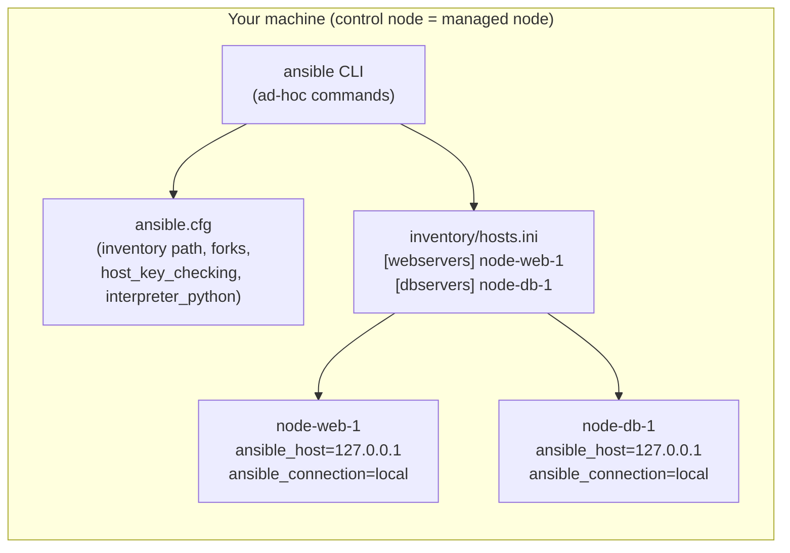

# Lab 09 — Ansible Basics: Inventory, Config, and Ad-Hoc Commands

This is the first lab in the Ansible track. Before writing playbooks, you need to understand the three pieces Ansible always uses: an **inventory** (the list of machines you manage), a **configuration file** (`ansible.cfg`, which controls how Ansible behaves), and **ad-hoc commands** (one-off module invocations from the shell — the same mechanism playbooks use under the hood). Everything here runs against `localhost`, so you need nothing more than Ansible installed. No cloud resources, no cost, no cleanup of real infrastructure.

## Learning Objectives

- Explain what an Ansible inventory is and group hosts into `[webservers]` and `[dbservers]`.
- Understand how `ansible.cfg` is discovered and which settings matter for a local lab.
- Run ad-hoc commands against all hosts, one group, and filtered facts.
- Read `ansible-doc` to discover module options without leaving the terminal.

## Architecture

This lab creates **no infrastructure** — it exercises Ansible's local connection against two logical hosts that both map to your own machine:



> In a real deployment `node-web-1` and `node-db-1` would be two separate remote servers reached over SSH. We label them distinctly here so group targeting behaves exactly as it would in production.

## Prerequisites

- **Ansible core** — any recent version. Verify with:
  ```bash
  ansible --version
  ```
  You want at least Ansible core 2.14+ (shipped with `ansible` 7+). Install options:
  - `python3 -m pip install ansible` (a `pipx install ansible` keeps it isolated), or
  - `sudo apt install ansible` on Debian/Ubuntu, `brew install ansible` on macOS.
  On **Windows**, Ansible cannot be a control node directly — use WSL2, the Git Bash terminal is **not** supported for running Ansible. This lab assumes Linux/macOS/WSL.
- **Python 3** — 3.9 or newer (Ansible's dependency).
- **Make** (optional) — only needed if you want to use the `Makefile` shortcuts.
- No cloud accounts, no environment variables, no secrets.

## Step-by-Step Instructions

1. Clone (or cd into) this lab directory:
   ```bash
   cd staging/lab-09-ansible-basics
   ```

2. (Optional) Confirm Ansible can see your config and inventory:
   ```bash
   ansible --version | head -1
   ansible-inventory --list
   ```
   Expected output (trimmed): a JSON structure with `"webservers"` and `"dbservers"` groups, each containing one host with `ansible_host: 127.0.0.1`.

3. **Ping everything.** The `ping` module is not ICMP — it verifies Ansible can log in and run Python on the target:
   ```bash
   ansible all -m ping
   ```
   Expected output:
   ```
   node-web-1 | SUCCESS => {
       "changed": false,
       "ping": "pong"
   }
   node-db-1 | SUCCESS => {
       "changed": false,
       "ping": "pong"
   }
   ```

4. **Ping one group only.** This is the whole point of groups — target a tier without naming hosts:
   ```bash
   ansible webservers -m ping
   ```
   Expected output: only `node-web-1` appears this time.

5. **Gather facts.** The `setup` module collects hundreds of facts (OS, memory, network…) about each host:
   ```bash
   ansible webservers -m setup
   ```
   Expected output: a very long JSON blob starting with `"ansible_all_ipv4_addresses"` etc. — that volume is normal.

6. **Filter the facts** — two ways, depending on your shell:
   ```bash
   # Option A: ask the module to filter (works everywhere, recommended)
   ansible webservers -m setup -a 'filter=ansible_distribution*'

   # Option B: grep the output (works in Git Bash / Linux / macOS)
   ansible webservers -m setup | grep ansible_hostname
   ```
   Expected output for option A (your values will vary):
   ```
   node-web-1 | SUCCESS => {
       "ansible_facts": {
           "ansible_distribution": "Ubuntu",
           "ansible_distribution_file_parsed": true,
           "ansible_distribution_file_path": "/etc/os-release",
           "ansible_distribution_file_variety": "Debian",
           "ansible_distribution_major_version": "24",
           "ansible_distribution_release": "noble",
           "ansible_distribution_version": "24.04"
       },
       "changed": false
   }
   ```

7. **Run an arbitrary shell command on all hosts:**
   ```bash
   ansible all -m shell -a "uptime"
   ```
   Expected output (uptime strings vary):
   ```
   node-db-1 | CHANGED | rc=0 >>
    14:32:11 up 3 days,  2:10,  1 user,  load average: 0.42, 0.30, 0.27

   node-web-1 | CHANGED | rc=0 >>
    14:32:11 up 3 days,  2:10,  1 user,  load average: 0.42, 0.30, 0.27
   ```
   (Identical load on both is expected — they are the same machine!)

8. **Tip — read the docs from the terminal.** Before using any module, check its options and examples:
   ```bash
   ansible-doc shell
   ansible-doc -l | grep -i file   # discover modules by keyword
   ```

9. (Optional) Use the `Makefile` shortcuts:
   ```bash
   make setup   # verify prerequisites
   make ping    # ansible all -m ping
   make deploy  # prints guidance (no playbooks exist yet in this lab)
   ```

## How Do I Know This Worked?

- `ansible all -m ping` returns `"ping": "pong"` for **both** `node-web-1` and `node-db-1`.
- `ansible webservers -m ping` returns success **only** for `node-web-1` (proves group targeting works).
- `ansible-inventory --list` shows both groups with exactly one host each.
- `ansible all -m shell -a "uptime"` exits with code `0` (check `echo $?` right after) and shows output from both hosts.

## Cleanup

Nothing is created on disk or in the cloud, so cleanup is simply leaving the directory. If you installed Ansible only for this lab and want to remove it:

```bash
pipx uninstall ansible        # if installed with pipx
# or
python3 -m pip uninstall ansible
```

No Terraform state, no cloud resources, no background processes exist.

## Troubleshooting

1. **`ansible: command not found`**
   - **Symptom:** Running any `ansible …` command fails immediately.
   - **Cause:** Ansible is not installed, or its install location (e.g. `~/.local/bin`) is not on your `PATH`.
   - **Fix:** Install per Prerequisites, then re-open your shell or run `export PATH="$HOME/.local/bin:$PATH"`. On Windows, use WSL2 — Ansible is not supported as a Windows control node.

2. **`ERROR! Attempting to decrypt but no vault secrets found` or `Unable to parse inventory/hosts.ini`**
   - **Symptom:** Inventory commands fail with a parse error naming a line number.
   - **Cause:** A typo in `inventory/hosts.ini` — most commonly a host line accidentally indented, a missing `=`, or a stray `:` where an `=` belongs.
   - **Fix:** Check the reported line number. Group headers must be `[name]` on column 0, and host variables use `key=value` separated by spaces. Re-run `ansible-inventory --list` after fixing.

3. **Ping succeeds for one group but `ansible all …` only hits one host (or warns "provided hosts list is empty")**
   - **Symptom:** `ansible all -m ping` shows a single host, or warns about an empty list.
   - **Cause:** `ansible.cfg` in the *current directory* isn't being read (Ansible only auto-reads `ansible.cfg` from the cwd, `$ANSIBLE_CONFIG`, or `~/.ansible.cfg`), so `inventory` points elsewhere or defaults to `/etc/ansible/hosts`.
   - **Fix:** Run commands from the lab directory, or set `export ANSIBLE_CONFIG=ansible.cfg`. Verify with `ansible-inventory --graph`, which should print both groups.

## Free Tier Notes

This lab uses **no cloud resources** — there is nothing to bill. Everything executes on your own machine via `ansible_connection=local`. (Free-tier terms at AWS/Terraform Cloud change over time anyway; whenever a later lab *does* create cloud resources, always run its `make destroy` / cleanup steps and double-check the billing console afterwards.)
