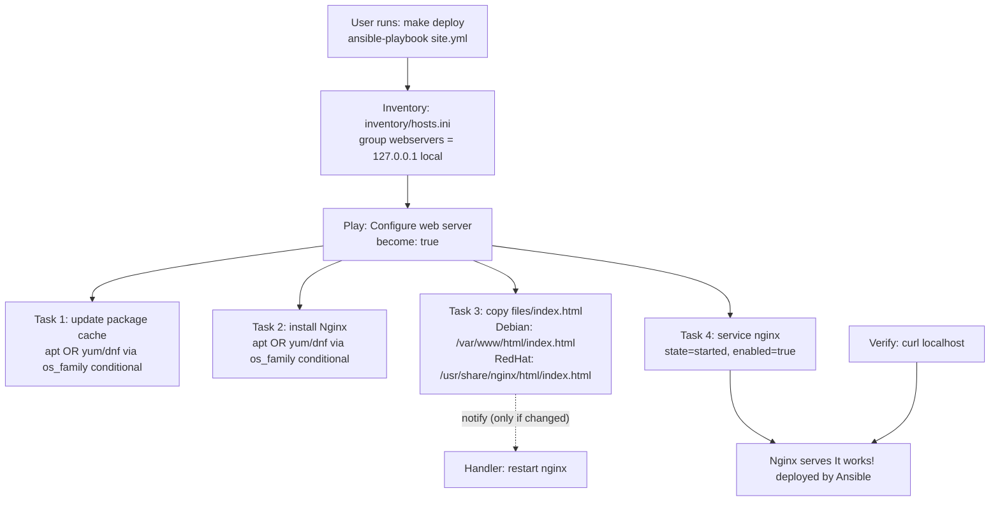

# Lab 10 — Playbooks: Idempotent Nginx Deployment with Ansible

This lab is your first complete Ansible playbook. You will write a `site.yml` that updates the package cache, installs Nginx, deploys a custom `index.html`, and starts the service — all idempotently, with a handler that restarts Nginx only when the deployed content actually changes. Everything runs against `localhost`, so you need nothing but a Linux machine (or WSL) and no cloud account at all.

## Learning Objectives

- Write a multi-task playbook with named plays, tasks, and handlers.
- Use `ansible_os_family` conditionals to run `apt` vs. `yum`/`dnf` tasks depending on the target OS.
- Use `ansible.builtin.copy` to deploy static files to OS-specific destinations (`/var/www/html` vs. `/usr/share/nginx/html`).
- Understand Ansible's change detection: what "changed" vs. "ok" means, and why re-runs show `changed=0`.
- Notify and trigger handlers (`restart nginx`) only when a task reports a change.
- Use `--check` mode for a safe dry run, and understand its limitations.
- Drive the whole workflow through a `Makefile` (`make test`, `make deploy`).

## Architecture



## Prerequisites

| Tool | Version | Notes |
|------|---------|-------|
| Ansible | >= 2.14 (core >= 2.14) | Install with `pip install ansible` on Linux/WSL |
| Python | >= 3.9 | Ansible's runtime |
| `sudo` access on localhost | — | The playbook uses `become: true` |
| OS | Ubuntu/Debian or a RHEL-family distro | WSL2 with Ubuntu on Windows works |
| curl | any | For the final verification step |
| ansible-lint, yamllint | optional | For `make lint` |

- **No cloud account and no cost**: everything runs on your own machine. (See *Free Tier Notes* — not applicable here, but keep the habit for cloud labs.)
- **No environment variables or secrets** are required for this lab. There is nothing to leak.
- On Windows: run all commands inside **WSL2 (Ubuntu)** or a Linux VM — Ansible cannot manage the Windows host directly with this playbook.

## Step-by-Step Instructions

All commands run from the lab directory (`staging/lab-10-playbooks` in the repo):

```bash
cd staging/lab-10-playbooks
```

1. **Verify the setup.**

   ```bash
   make setup
   ansible --version
   ```

   Expected: `ansible [core 2.14.x]` (or newer) and `curl: OK`.

2. **Confirm Ansible can talk to the inventory.** The `ping` module is not an ICMP ping — it verifies Python connectivity and permissions on the target.

   ```bash
   make ping
   ```

   Expected output:

   ```
   127.0.0.1 | SUCCESS => {
       "changed": false,
       "ping": "pong"
   }
   ```

3. **Dry run in check mode.** This walks through the playbook and reports what *would* change without changing anything.

   ```bash
   make test        # same as: ansible-playbook -i inventory/hosts.ini site.yml --check
   ```

   **Important limitation**: with `apt`, check mode cannot always know whether a package is installed if the package cache is stale, so you may see `changed` for the cache task or a warning that a package status could not be determined. Check mode is a rehearsal, not a guarantee — the real run is the source of truth.

4. **Run the playbook for real.**

   ```bash
   make deploy      # same as: ansible-playbook -i inventory/hosts.ini site.yml
   ```

   Expected output (abridged):

   ```
   PLAY [Configure the web server (Nginx)] *************************
   TASK [Gathering Facts] ****************************************** ok: [127.0.0.1]
   TASK [Update apt package cache (Debian family)] ***************** changed: [127.0.0.1]
   TASK [Update yum/dnf package cache (RedHat family)] ************* skipping: [127.0.0.1]
   TASK [Install Nginx (Debian family)] **************************** changed: [127.0.0.1]
   TASK [Deploy index.html (Debian family)] ************************ changed: [127.0.0.1]
   TASK [Start and enable Nginx] *********************************** changed: [127.0.0.1]
   RUNNING HANDLER [Restart nginx] ********************************* changed: [127.0.0.1]
   PLAY RECAP ******************************************************
   127.0.0.1  : ok=6  changed=5  unreachable=0  failed=0  skipped=1
   ```

   Notice the RedHat tasks show `skipping` — that is the `when: ansible_os_family == ...` conditional working.

5. **Prove idempotence — run it again.**

   ```bash
   make deploy
   ```

   Expected: every task shows `ok`, the handler does **not** run (nothing notified it), and the recap shows `changed=0`:

   ```
   PLAY RECAP ******************************************************
   127.0.0.1  : ok=5  changed=0  unreachable=0  failed=0  skipped=1
   ```

6. **Edit the page and watch the handler fire.** Change a word in `files/index.html`, then run `make deploy` again. This time the copy task reports `changed`, which notifies the handler, and you will see `RUNNING HANDLER [Restart nginx]` in the output. This demonstrates the notify/handler mechanism.

7. **(Optional) Lint the playbook.**

   ```bash
   make lint
   ```

## How Do I Know This Worked?

1. **The idempotent re-run** above showing `changed=0` is the strongest signal.
2. **HTTP check** — Nginx should serve your page:

   ```bash
   curl -s localhost | head -n 5
   ```

   Success looks like:

   ```html
   <!DOCTYPE html>
   <html lang="en">
   ...
   ```

   And the body contains:

   ```bash
   curl -s localhost | grep -i "deployed by Ansible"
   # => <p>deployed by Ansible</p>
   ```

3. **Service state check:**

   ```bash
   systemctl status nginx --no-pager
   ```

   Success looks like `Active: active (running)` and `Loaded: ... enabled`.

4. **Full playbook syntax check** (fast, no execution):

   ```bash
   ansible-playbook -i inventory/hosts.ini site.yml --syntax-check
   ```

   Success: no output and exit code 0.

## Cleanup

This lab touches only your local machine, but leave it clean anyway:

```bash
make destroy
```

This stops and disables Nginx, removes `/var/www/html/index.html`, and prints the command to uninstall Nginx completely if you want to:

```bash
sudo apt remove nginx        # Debian/Ubuntu
# or
sudo yum remove nginx        # RHEL family
sudo systemctl daemon-reload
```

Also run `make clean` to remove `*.retry` files and Python caches.

## Troubleshooting

**1. Symptom: `make ping` fails with `"msg": "Failed to connect to the host via ssh: Permission denied"`.**
Cause: `ansible_connection=local` is missing from the inventory line for `127.0.0.1`, so Ansible tried SSH to localhost.
Fix: Ensure `inventory/hosts.ini` contains `127.0.0.1 ansible_connection=local` (it ships that way — check you didn't edit or override the inventory with `-i`).

**2. Symptom: the apt tasks fail with `"Could not get lock /var/lib/dpkg/lock"` or similar.**
Cause: another process (an unattended upgrade, `apt` in another terminal) holds the package lock.
Fix: Wait for the other process to finish (`sudo lsof /var/lib/dpkg/lock` shows who holds it), or reboot. Do **not** delete the lock files.

**3. Symptom: `curl localhost` returns the default Nginx welcome page (or a 403) instead of "It works! deployed by Ansible".**
Cause: on a RedHat-family host, your browser/curl hit the default page in a different document root, or the copy task targeted the wrong path.
Fix: Confirm `ansible_os_family` with `ansible -i inventory/hosts.ini webservers -m ansible.builtin.setup -a "filter=ansible_os_family"` and check which deploy task ran; on RedHat the page must live at `/usr/share/nginx/html/index.html`. Re-run `make deploy` after fixing the path.

## Free Tier Notes

This lab uses **no cloud resources at all** — Nginx runs on your own machine, so there is nothing to bill. In later labs of this repository you will provision real cloud resources; remember that free tiers change over time, always run the documented **Cleanup** steps, and check your cloud provider's billing console afterwards to confirm no charges.
