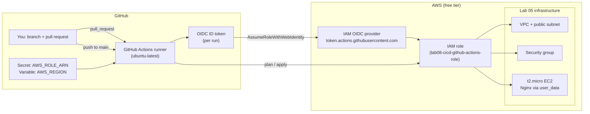

# Lab 08 — Terraform CI/CD with GitHub Actions & AWS OIDC

Run Terraform the way real teams do: a GitHub Actions workflow that runs `terraform plan` (read-only) on every pull request and `terraform apply` when the PR merges to `main`. Instead of storing long-lived AWS access keys in GitHub Secrets, the workflow authenticates with **OpenID Connect (OIDC)**: GitHub mints a short-lived ID token for each run, AWS verifies it against a trust policy, and the runner receives temporary credentials for a single IAM role. You will bootstrap the OIDC provider and role with Terraform itself, then never touch IAM again.

## Learning Objectives

- Explain what GitHub Actions OIDC is and why it beats stored access keys (no secrets to rotate, no keys to leak).
- Create an `aws_iam_openid_connect_provider` and an IAM role with a trust policy scoped to one repository.
- Write a workflow with `permissions: id-token: write` that authenticates via `aws-actions/configure-aws-credentials@v4`.
- Gate changes safely: `plan` (read-only) on pull requests, `apply -auto-approve` only after merge to `main`.
- Understand why CI needs a state backend strategy (and why local state breaks across CI runs).

## Architecture



- **Pull request opened/updated** → job runs `fmt -check`, `init`, `validate`, `plan`, and posts the plan to the job summary. Nothing is applied.
- **PR merged (push to `main`)** → same checks, then `terraform apply -auto-approve` using the plan file, then `terraform output`.
- **Authentication** → the runner exchanges its OIDC ID token for AWS credentials. The trust policy (in `oidc.tf`) only allows tokens whose `sub` claim belongs to your repository.

## Prerequisites

| Tool / Account | Version | Notes |
|---|---|---|
| GitHub account + fork of this repo | free | The workflow runs on the free `ubuntu-latest` runner |
| AWS account | free tier | 12 months free tier required for `t2.micro` |
| Terraform | >= 1.5.0 | `terraform version` |
| AWS CLI | >= 2.x | Needed once for bootstrap auth, `aws --version` |
| `make` | any | Git Bash/WSL on Windows includes it |

**AWS credentials for bootstrap (one time only):** configure a profile with IAM admin rights, e.g. `aws configure` with `AWS_ACCESS_KEY_ID` / `AWS_SECRET_ACCESS_KEY` of a bootstrap user, or use AWS CloudShell (it has credentials built in — easiest). After the role exists, these bootstrap keys are no longer needed for CI.

**GitHub repository settings you will create in this lab:**

| Type | Name | Value |
|---|---|---|
| Secret | `AWS_ROLE_ARN` | Output of `terraform output github_actions_role_arn` |
| Variable (optional) | `AWS_REGION` | e.g. `us-east-1` (workflow defaults to `us-east-1`) |

There are **no environment variables you must set locally** — the AWS CLI reads `AWS_ACCESS_KEY_ID`, `AWS_SECRET_ACCESS_KEY`, and `AWS_DEFAULT_REGION` from your profile automatically.

## Step-by-Step Instructions

### 0. Set your repository name

Edit `oidc.tf` and replace the placeholder in `local.github_repo`:

```hcl
github_repo = "YOUR_GITHUB_USERNAME/devops-labs-terraform-ansible"
```

### 1. Bootstrap the OIDC provider and role with Terraform

This needs real AWS credentials once. From AWS CloudShell (recommended) or a machine with `aws configure`d admin keys:

```bash
make setup          # verifies terraform + aws CLI
terraform init
terraform apply -target=aws_iam_openid_connect_provider.github \
                -target=aws_iam_role.github_actions \
                -target=aws_iam_role_policy.github_actions
```

> `-target` applies **only** the auth plumbing first, so the role that CI needs exists before CI runs. Terraform will warn about `-target`; that's expected here.

Expected output ends with:

```
Apply complete! Resources: 3 added, 0 changed, 0 destroyed.

Outputs:
github_actions_role_arn = "arn:aws:iam::<acct>:role/lab08-cicd-github-actions-role"
```

### 2. Set the GitHub Secret

In your fork: **Settings → Secrets and variables → Actions → New repository secret**

- Name: `AWS_ROLE_ARN`
- Value: the ARN from step 1

Optionally add **Variables → New repository variable** `AWS_REGION = us-east-1`.

> **Only `AWS_ROLE_ARN` is required.** Never create `AWS_ACCESS_KEY_ID` / `AWS_SECRET_ACCESS_KEY` secrets — that would defeat the point of this lab.

### 3. Open a pull request

```bash
git checkout -b lab08-example
# any small .tf change, e.g. edit the echo text in main.tf's user_data
git add . && git commit -m "ci: test plan on PR"
git push origin lab08-example
```

Open a PR on GitHub. The **terraform-cicd** workflow runs: fmt → init → validate → plan. Click the workflow run → **Summary** to see the rendered plan.

### 4. Merge and watch the apply

Merge the PR (merge commit, squash, or rebase — any works). The push to `main` triggers the workflow again, this time with an extra **Terraform apply** step. Expected tail of the log:

```
aws_instance.web: Creation complete ...
Apply complete! Resources: 6 added, 0 changed, 0 destroyed.
Outputs:
nginx_url = "http://ec2-...compute.amazonaws.com"
```

Copy `nginx_url` into a browser — you should see *"Hello from Lab 08 — deployed by GitHub Actions + Terraform!"*.

### Alternative: create the OIDC provider manually (Option B)

If you don't want Terraform to own the OIDC provider (e.g. your org already has one, or you prefer console clicks), do it by hand:

1. **IAM → Identity providers → Add provider → OpenID Connect**: URL `https://token.actions.githubusercontent.com`, audience `sts.amazonaws.com`. Get the thumbprint from AWS's docs (or let the console fetch it) — the current value is already in `oidc.tf` as `github_oidc_thumbprint`.
2. **IAM → Roles → Create role → Web identity**, pick the provider, then paste this trust policy (replace `YOUR_GITHUB_USERNAME`):

```json
{
  "Version": "2012-10-17",
  "Statement": [
    {
      "Effect": "Allow",
      "Principal": {
        "Federated": "arn:aws:iam::<ACCOUNT_ID>:oidc-provider/token.actions.githubusercontent.com"
      },
      "Action": "sts:AssumeRoleWithWebIdentity",
      "Condition": {
        "StringEquals": {
          "token.actions.githubusercontent.com:aud": "sts.amazonaws.com"
        },
        "StringLike": {
          "token.actions.githubusercontent.com:sub": "repo:YOUR_GITHUB_USERNAME/devops-labs-terraform-ansible:*"
        }
      }
    }
  ]
}
```

3. Attach a policy giving the role `ec2:*` in your region (see `oidc.tf` for the exact scoped policy), then put the role ARN in `AWS_ROLE_ARN` and **delete/comment out `oidc.tf`** (otherwise Terraform tries to create a provider that already exists). If you keep the provider but want Terraform to only *read* it, use the commented `data "aws_iam_openid_connect_provider"` block in `providers.tf` instead.

### State backend for CI

This lab uses the **local backend** (default): `terraform.tfstate` sits wherever `init` ran. That works for learning because the *apply* on `main` is the only write; the PR-time `plan` runs without prior state, so it plans everything as "to create" rather than showing a true diff against real infrastructure. For production, use a remote backend so every run shares one state file:

- **S3 backend + DynamoDB locking** — the classic choice. See the [S3 backend docs](https://developer.hashicorp.com/terraform/language/settings/backends/s3) and [AWS's guide to locking](https://docs.aws.amazon.com/prescriptive-guidance/latest/terraform-backend-s3/intro.html).
- **Terraform Cloud free tier** — zero infrastructure to manage. See [Terraform Cloud](https://developer.hashicorp.com/terraform/cloud-docs) and Lab 04 of this repo.

The workflow needs no changes for a remote backend beyond authenticating to it (OIDC role plus, for S3, `s3:*`/`dynamodb:*` on the state bucket/lock table).

## How Do I Know This Worked?

1. **PR run**: on the PR page, the `terraform-cicd` check is green. Open the run → **Summary** shows a "## Terraform Plan" section ending with `Plan: N to add, 0 to change, 0 to destroy.`
2. **Merge run**: the `main` branch run is green and its log contains `Apply complete! Resources: 6 added, 0 changed, 0 destroyed.`
3. **Nginx responds**: `curl $(terraform output -raw nginx_url)` returns HTML containing `Hello from Lab 08`. (Note: `user_data` takes 1–2 minutes after the instance reaches `running`.)
4. **No keys anywhere**: **Settings → Secrets and variables** shows only `AWS_ROLE_ARN` (and maybe `AWS_REGION`) — no `AWS_ACCESS_KEY_ID`.

## Cleanup

```bash
# 1. Tear down ALL infrastructure created by this lab (asks for confirmation):
make destroy

# 2. Remove local artifacts (state files, .terraform dir, plan files):
make clean

# 3. Remove the GitHub Secret if you are done with the lab:
#    Settings → Secrets and variables → Actions → delete AWS_ROLE_ARN
```

Then check the AWS console (EC2, VPC, IAM → Roles) is empty of `lab08-cicd-*` resources.

## Troubleshooting

**1. Workflow fails with `Error: Could not assume role with OIDC` / `AccessDenied`.**
*Symptom:* the "Configure AWS credentials via OIDC" step goes red.
*Cause:* the trust policy doesn't match your repo — most often `local.github_repo` in `oidc.tf` still says `YOUR_GITHUB_USERNAME/...`, or the role was created before you fixed it.
*Fix:* correct `local.github_repo`, re-run `terraform apply` for the role, and re-run the failed workflow. Also confirm the secret name is exactly `AWS_ROLE_ARN` (spelling and case matter).

**2. `plan` on a PR shows `Plan: 6 to add` even though everything exists (or `apply` fails with "DuplicateTagKeys"/"already exists").**
*Symptom:* second run wants to recreate everything, or apply hits `EntityAlreadyExists`.
*Cause:* the local backend — the PR runner had no `terraform.tfstate`, so it planned from an empty state. This is the CI state problem described above.
*Fix:* for this lab it's cosmetic (merge anyway). For real projects, move state to S3 or Terraform Cloud; also run `terraform import` for any manually created resources.

**3. `terraform fmt -check` fails in CI but files look fine locally.**
*Symptom:* the first workflow step fails with a list of files.
*Cause:* formatting differs — usually 4-space indentation or misaligned `=` (the standard is 2 spaces, aligned assignments), or you edited on Windows and introduced CRLF/ trailing whitespace in odd spots.
*Fix:* run `terraform fmt -recursive` locally, commit, push. Add `make lint` to your local loop to catch it before pushing.

## Free Tier Notes

- The `t2.micro` instance is free for **12 months from account creation** (750 hours/month). A stopped/terminated instance stops accruing hours.
- The VPC, subnet, security group, route table, internet gateway, IAM provider, and IAM role are **always free**.
- AWS free tiers change. Always run `make destroy` when done and check **AWS Console → Billing → Bills** after the lab.
- GitHub Actions is free for public repos (2,000 minutes/month on private free accounts); this workflow uses ~2 minutes per run.
